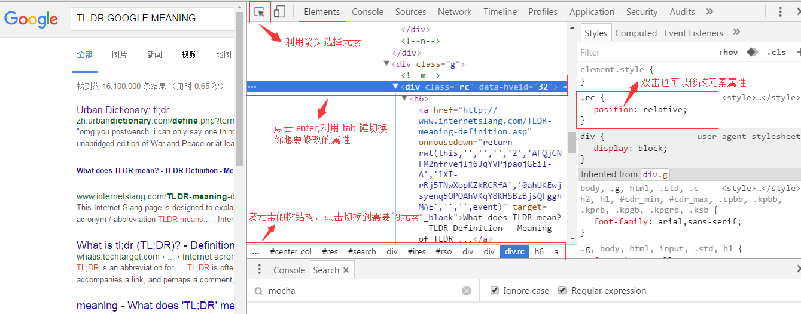
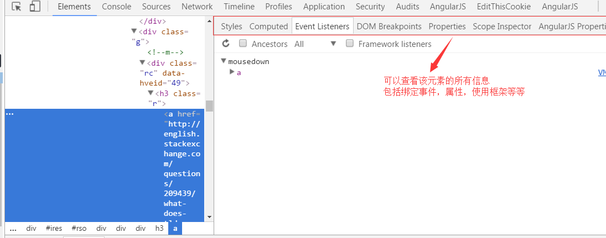

---   
title: google_developers   
tags: google_developers   
birth: 2016-8-28 17:19:52   
modified: 2016-9-23 13:51:20   
---

goole 开发者文档阅读
===
---
_前言：讲解在阅读 google 开发者文档中学到的经验和技巧_

# 控制台调试
打开控制台`f12` 或 `ctrl+shift+i`
## 编辑元素
右键点击源码中的元素可以看到更多的可操作项。

此外注意看元素栏的右边可以看到该元素的所有属性，一般在调试时
我们会关注元素的绑定事件等信息。此外还可以利用插件来查看元素绑定了那些框架属性。

## devtool 中的快捷键

[快捷键完整版](https://developers.google.com/web/tools/chrome-devtools/iterate/inspect-styles/shortcuts?hl=en)

1. 打开调试窗口的方法

|       功能 |  windows 快捷键 |
| ---------: | --------------: |
| 打开控制台 | f12、ctrl+alt+i |
|   选择元素 |      ctrl+alt+c |
| 打开控制台 |    ctrl+shift+j |

2. 全局快捷键   
注意:一下快捷键实在打开调试器后的作用 

|                     功能 |                  windows 快捷键 |
| -----------------------: | ------------------------------: |
|           打开调试器帮助 |                              f1 |
|               打开下载器 |                          ctrl+j |
|           切换调试器面板 |          ctrl+\[ 或者 ctrl + \] |
| 返回到上一步的调试器面板 | ctrl+alt+\[ 或者 ctrl + alt +\] |
|     改变调试器的布局位置 |                ctrl + shift + d |
|   改变视图窗口为手机布局 |                    ctrl+shift+m |
|           快速打开控制台 |                             esc |
|                 刷新界面 |                  f5 或 ctrl + r |

## 插件使用

