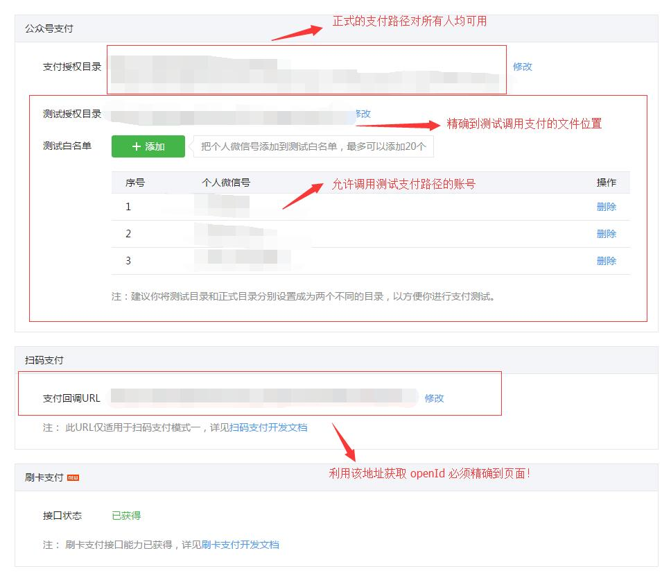

wechatPay
===
**前言:微信支付**

---

# 概述
## 支付模式

支持的支付模式
1. 刷卡支付  适用于线下面对面收银场景
2. 扫码支付 商户系统生成支付二维码,无需面对面的支付方式
3. 公众号支付 公众号内调用支付接口完成支付 
4. APP 支付 调用微信 sdk 接口完成支付行为

## 技术术语
* **微信公众平台** 微信提供企业服务的轻应用
* **微信开放平台** 提供给第三方调用微信接口的能力.为开发者模式
* **微信商户平台** 提供微信支付的功能平台
* **微信企业号** 不清楚?
* **微信支付系统** 实现微信支付等逻辑的系统
* **商户收银系统** POS 收银机,用来录入商品信息,生成订单,客户支付,打印小票的机器
    * 需要搞清楚 POS 机软体的运行方式
* **商户后台系统** 商户后台处理业务逻辑的总称
* **商户证书** 提供二进制文件，作为微信支付的后台凭证
* **签名** 常用签名算法 MD5,SHA128,SHA256,HMAC
* **openId** 用户在公众号下的唯一标识
* **mch_id** 微信支付对应的商户 id 号
* **api 秘钥** 商户系统和微信后台进行交易的接口秘钥
* **Appid** 公众号 id
* **Appsecret** 公众号秘钥

对于开发重点关注的参数如下:

**APPID** 微信服务号对应的识别 id
**mch_id** 开通微信支付后对应的商户账号
**API 密钥** 支付交易中的签名密钥,用于微信核对支付信息
**Appsecret** 调用微信接口的凭证

详情参见 [支付账户](https://pay.weixin.qq.com/wiki/doc/api/micropay.php?chapter=3_1)

## 微信支付协议规范
1. 采用 https 的方式传输
2. 采用 post 方式提交
3. 采用 xml 进行数据交互
4. 采用 utf8 编码
5. 签名算法进行接口验证
6. 签名要求
    1. 将所有非空的参数按照字典排序生成 stringA
    2. 生成摘要
    
        ```
         
           stringSignTemp="stringA&key=192006250b4c09247ec02edce69f6a2d"
           sign=MD5(stringSignTemp).toUpperCase()="9A0A8659F005D6984697E2CA0A9CF3B7"
            
        ```
    3. 将生成的新字段添加到传入参数中，作为一个新字段
    字段中有一个 `nonce_str` 为随机项，用来保证签名的不可预测性。
    4. 微信证书的说明
    [微信证书的作用](https://pay.weixin.qq.com/wiki/doc/api/jsapi.php?chapter=4_3)
7. 证书要求
8. 逻辑判断
    1. 先判断协议字段，错误返回
    2. 再判断业务，错误返回
    3. 最后判断交易状态，错误返回
    


# 支付开发
## 支付字段规定
### 对应支付选择
在不同支付场景使用对应开发接口。
其中选择方式如下。

| 使用场景         | 支付模式   | 商品字段规则             | 样例                    | 备注                                     |
| :--------------- | ---------- | ------------------------ | ----------------------- | ---------------------------------------- |
| PC 网站          | 扫码支付   | 商品主页-商品描述        | qq 会员充值             | 无                                       |
| 微信浏览器       | 公众号支付 | 商家名称-销售商品类目    | 逻辑思维-图书           | 线上商店，商家名称必须为实际销售商品店家 |
| 门店扫码         | 公众号支付 | 店名-销售商品类目        | 天虹南山店-超市         | 线下门店支付                             |
| 门店扫码         | 扫码支付   | 店名-销售商品类目        | 天虹南山店-超市         | 线下门店支付                             |
| 门店刷卡         | 刷卡支付   | 店名-销售商品类目        | 天虹南山店-超市         | 线下门店支付                             |
| 第三方手机浏览器 | H5 支付    | 主页 title 名-商品概述   | 腾讯充值中心-QQ会员充值 |
| 第三方 APP       | APP 支付   | 应用市场 APP 名-商品概述 | 天天爱消除-游戏充值     |

[微信门店详解](https://mp.weixin.qq.com/wiki)

### 金额要求
**微信支付金额限定在对应币种的最小单位**

交易类型

* JSAPI-- 公众号支付
* NATIVE -- 原生扫码支付
* APP -- app 支付，以上利用统一支付接口进行调用
* MICROPAY -- 有单独的接口

货币种类

* CNY 人民币

时间必须为北京时间，精确到秒

商户订单号，由商户自行生成，必须保证唯一性（采用系统时间加随机序列来生成订单号）
具体规则。
    * 若支付失败重新支付，使用原订单号
    * 已支付或关闭撤销订单需重新生成订单号

银行类型参见下表 [参数规定](https://pay.weixin.qq.com/wiki/doc/api/micropay.php?chapter=4_2)

[证书功能详解](https://pay.weixin.qq.com/wiki/doc/api/micropay.php?chapter=4_3)


## 支付前期准备
准备工作，必须包含如下条件
* 有认证了的服务号并且开通了微信支付
* 获取如下信息写入微信官方 demo 配置文件
    * **AppID** 绑定微信支付的服务号    
    * **AppSecret** 绑定微信支付的服务号密码    
    * **Mch_id** 商户编号,微信支付->商户信息查看 
    * **APIKey** 商户支付密钥,在微信支付中使用的密钥, 商户 -> api 安全查看
    * **SSLCERT_PATH** 
    * **SSLKEY_PATH**

支付开发流程如下
1. 配置微信公众平台
    1. 开发基本配置保证服务器的正常连接
    2. 设置，公众号设置 -> 功能设置中允许域名接口
    3. 微信支付中修改支付授权目录和支付回调 url
    4. 安装对应证书
    
2. 利用参看 [微信授权](https://mp.weixin.qq.com/wiki/17/c0f37d5704f0b64713d5d2c37b468d75.html)获取 code

<https://open.weixin.qq.com/connect/oauth2/authorize?appid=wx37bcdb3936e6fb03&connect_redirect=1&redirect_uri=http:%2F%2F1.zsyd.applinzi.com%2FYDPAY%2Fcharge.test.php&response_type=code&scope=snsapi_base&state=STATE>
  
3. 利用 code 获取 opneid

4. 利用 openid 生成账单

5. 利用账单调用微信支付接口


    
## 常见坑
### redirect_url 错误

去公众号设置->功能设置中修改文件路径即可
添加网页授权路径即可.
1. 必须精确到调用支付的文件夹
2. 不允许有 `_` 为字符的文件名
3. **支付路径必须和公众号中设置的完全一样,特别是 `//` `/` 的问题**

### 不使用微信库如何获取 openId

参看 [微信授权](https://mp.weixin.qq.com/wiki/17/c0f37d5704f0b64713d5d2c37b468d75.html)

[论坛讨论](MP_verify_aD3mRHUdJlbXazQP.txt)

### 支付中路径设置问题



[支付路径的坑](http://www.mengyunzhi.com/share/develop-en/183-wepay-the-url-not-regestirer.html)


### 微信公众号被查封处理步骤

[微信查封说明](http://kf.qq.com/faq/170118UnqeUZ170118mUb6fu.html?pass_ticket=EiDyGZ30yCvUm%2Ffl6uysrqp2lByF%2FLonvOC6%2B0tZ9abuf7dQdEbXdZ96xWk2qxSB)

### 微信支付成功的正确判断
[正确逻辑](https://pay.weixin.qq.com/wiki/doc/api/jsapi.php?chapter=7_1)


# 获取用户 openId 
[用户 openId](https://pay.weixin.qq.com/wiki/doc/api/micropay.php?chapter=4_4)

由于在微信体系中，用户 openId 对于不同公众号具有唯一性。
建议在用户注册阶段直接存入，数据库。方便后续调用。重点。


# api 详解

| 接口         | 功能                                                                  |
| :----------- | --------------------------------------------------------------------- |
| 刷卡支付     | 需要用户提供授权码                                                    |
| 查询订单     | 用来获取支付订单状态                                                  |
| 撤销订单     | 撤销订单，再支付成功以内的 7 天均有效，注意在支付 15 s 后才执行次操作 |
| 退款接口     | 支持对金额的返回，一年之内有效，                                      |
| 退款状态查询 | 零钱支付 20 分钟内返还，银行卡最长为 3 天时间                         |


采用微信平台进行微信测试

[用户充值原理](http://www.jianshu.com/p/2cb959529c96#comments)


## 企业付款
[微信企业支付](https://pay.weixin.qq.com/wiki/doc/api/tools/mch_pay.php?chapter=14_2)
