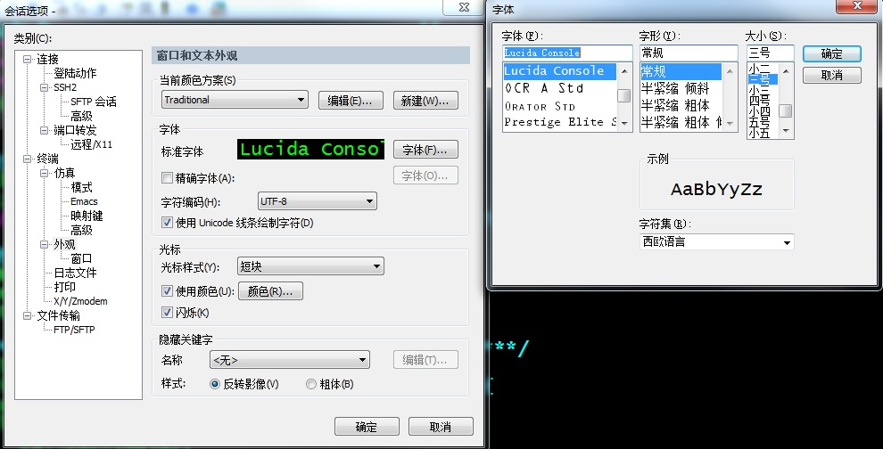
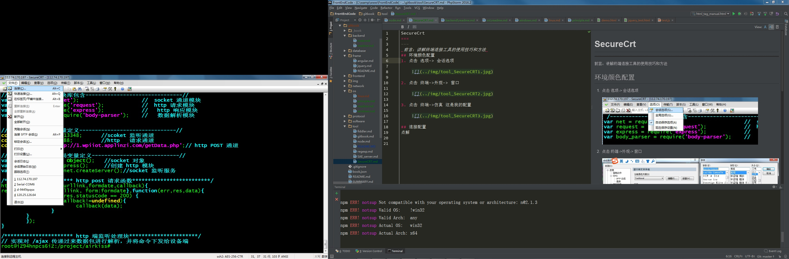
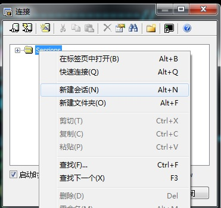
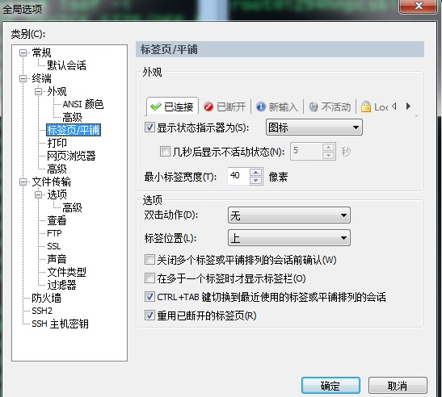
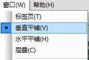
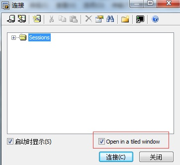
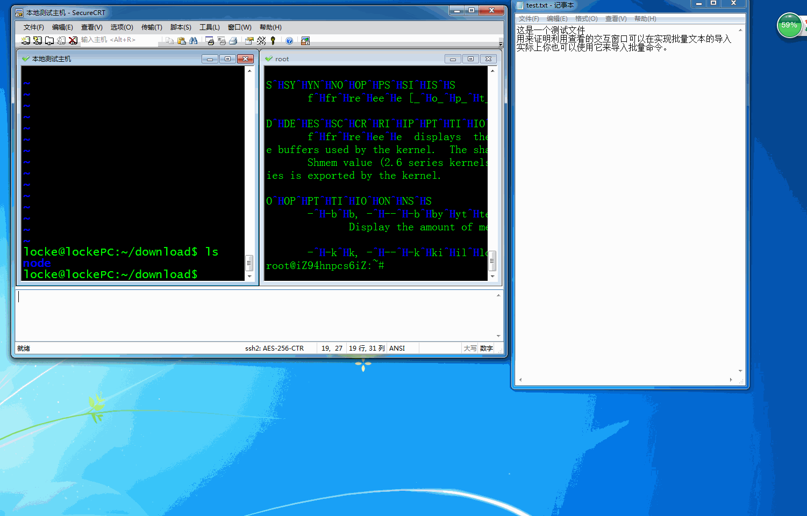
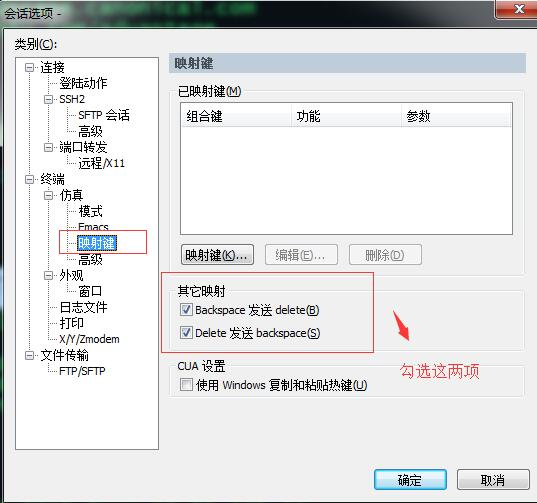

# SecureCrt 
**前言：讲解终端连接工具的使用技巧和方法**

---

## 全局环境配置
1. 点击选项->全局选项


## 环境颜色配置
1. 点击 选项-> 会话选项 弹出如下，再点击 终端->外观-> 窗口，注意**要把字符编码选为， UTF-8**,
记住，编码决定了处理数据的逻辑，字体只是决定了处理结果的显示方式，所以在使用软件时看到出现乱码，是
编码方式出错了，而不是字体有问题！

    
 
2. 点击 终端->仿真 这是我的配置

    

## 连接配置
1. 点击 文件-> 连接，再 sessions 上点击右键，新建会话

  
  
2. 在新建会话上选择 会话类型，填入主机 IP 等信息。

## 分屏操作
1. 点击选项-> 全局选项，在打开对话框中选择 终端->标签页/平铺 这是我的配置

  
  
2. 点击窗口->垂直平铺

    
    
3. 打开新的会话是注意勾选在层叠窗口打开，不然 SecureCRT 会新建窗口打开会话
 
     
        
### 交互窗口
选择查看->交互窗口可以实现批量的命令导入。
在使用 vi 复制文本时十分有效。举例如下:


        
## 使用问题
1. delete 变为 `^h`
选择选项 -> 会话选项，按照图示勾选两项后，重启会话

2. 方向键失灵
```shell
    # 查看用户是否设置 shell
   grep <user_name> /etc/passwd
    
    # 修改shell
    chsh -s /bin/bash
```
重启会话及正常。




