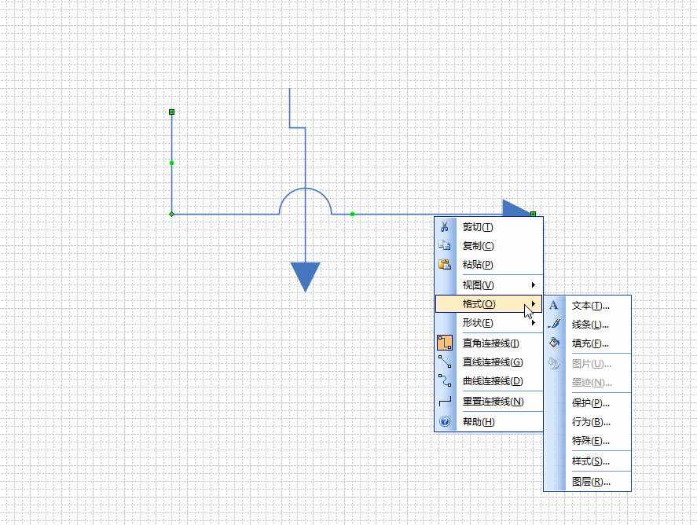

# visio

**前言:讲解 visio 的使用**

---

## 箭头的设置技巧
1. 跨过线时不弯曲
选择跨过后弯曲的的线，按照如下设置

实际上也可以利用，行为中的放置设置线条的穿过行为。

## 快捷键使用
### 工具选择
* `ctrl + 1` 指针工具
* `ctrl + shift + .` 放大字体
* `ctrl + shift + ，` 缩小字体

1. 插入超链接
* `ctrl + k` 选中需要插入快捷键图形，若插入错误选中取消即可

[visio 快捷键](https://support.office.com/zh-cn/article/Visio-%E7%9A%84%E9%94%AE%E7%9B%98%E5%BF%AB%E6%8D%B7%E6%96%B9%E5%BC%8F-ee952f31-7e3e-4564-8116-f3ecbb733cc1)

## 连接点
连接点是指视图上的小差。如不想显示连接点
* 视图->取消连接点勾选即可

[连接点说明](https://support.office.com/zh-cn/article/%E6%B7%BB%E5%8A%A0%E3%80%81%E7%A7%BB%E5%8A%A8%E6%88%96%E5%88%A0%E9%99%A4%E8%BF%9E%E6%8E%A5%E7%82%B9-5669491f-9fce-4676-81f8-ef4553788416#bm4)

## 创建子流程
### 根据部分内容创建子流程
1. 选中部分流程
2. 选择进程 -> 根据所选内容创建

### 创建完整的子流程
1. 拖出子流程形状
2. 选择进程 -> 新建
3. 在新建的图表中添加子流程

可以利用 进程 -> 链接到现有页面控制子流程的跳转位置
利用 `alt + 鼠标左键` 跳转到子流程。  

## 首字母大写改小写
`工具` -> `自动更正选项` 取消首字母大写功能