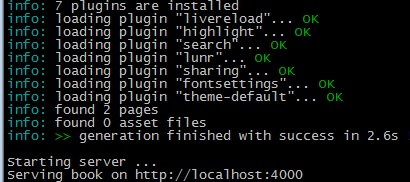
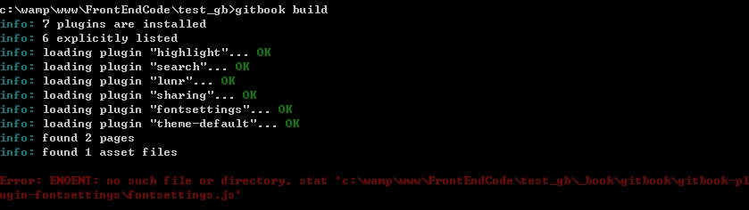
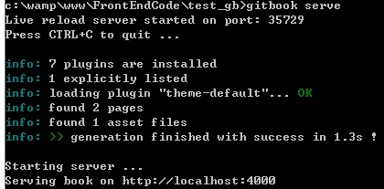
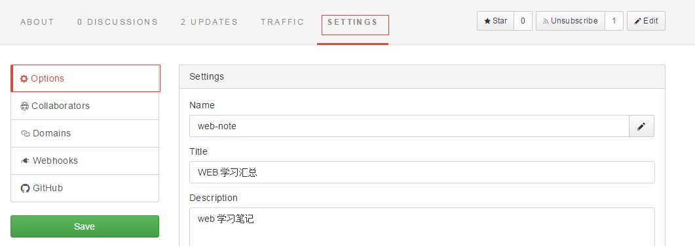
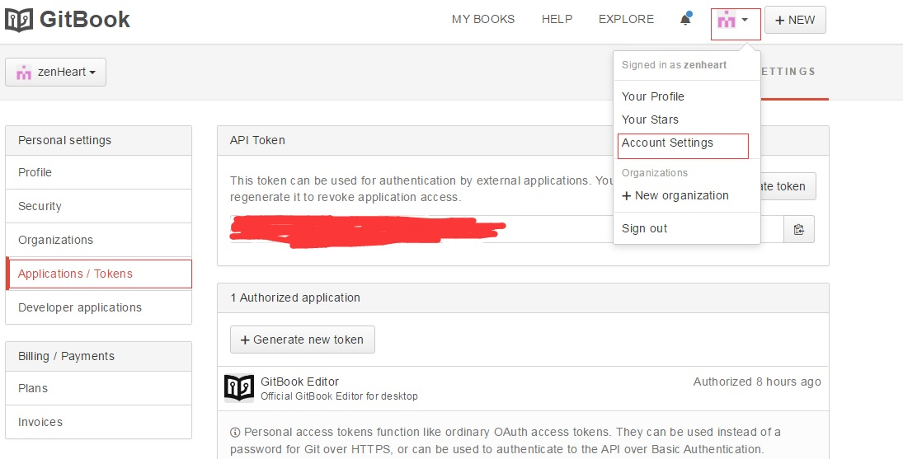

# gitbook 使用入门

**前言：讲解使用 gitbook 制作电子书的方法**   

---

## gitbook 基本介绍
**gitbook** 是用来制作电子书的开源工具。使用 [markdown](markdown) 文法来撰写文章。利用 gitbook 实现网络版的电子书制作。   
除此之外你还可以将书籍导出为 *epub*、*pdf*、*mobi* 的格式，方便自己和他人阅读。   

## 快速入门
### 安装 gitbook
1. 软件安装，软件的使用方法参见[附录教程](#appendix)

      [gitbook 官方下载地址](https://www.gitbook.com/editor)

2. 命令行安装

    在安装 node 环境的基础上，利用 npm 安装 gitbook<br>
    (对 node 和 npm 不懂的请参看 [node 入门](node_guide.md))
    ```
    npm install gitbook-cli -g //全局安装 gitbook
    ```

### 初始化gitbook
安装后，显示安装版本来确认安装成功
```
gitbook -V //注意 V 大写
```
新建目录，在其中初始化 gitbook
```
gitbook init
```
初始化后默认生成文件如下
```
.
├── README.md
└── SUMMARY.md
```
编辑 `SUMMARY.md` 修改内容
```
# Summary

* [Introduction](README.md)
* [第一章](c1/c1s1.md)
```
更改原路径为如下结构，并在`c1s1.md` 中编写**markdown**文件
```
.
├── README.md
└── SUMMARY.md
├── c1/
|   └── c1s1.md
```

### 编译运行 gitbook
编译的作用是将 markdown 文件转变为可以访问的 html
```
gitbook build
```
开启 gitbook 服务
```
gitbook serve
```
编译成功后显示信息



在浏览器中打开连接


### 错误及说明
1. 在 windos 上安装 gitbook 的软件后，可以直接像使用
markdown 编辑器一样去撰写书籍，上传到自己的 gitbook 账户即可浏览。
2. 笔者在 windos 7 上运行 `gitbook build` 时会出现如下错误


错误是随机的也可能发生别的组件安装缺失的情况，解决步骤如下

   1. 在主目录下建立 book.json 的文件
   2. 根据错误提示安装对应的组件包，组件包去 [NPM 官网](https://www.npmjs.com/) 中查找
   3. 查找到对应安装包名称后，在 book.json 中写入如下内容
    ```
   {
        "plugins": ["-fontsettings","-sharing","-lunr","-search","-highlight","-livereload"]
    }

    ```
   4. 重新编译`gitbook build`
   5. 重新启动服务`gitbook serve`
   6. 此时会显示如下信息说明启动成功

      

   7. 打开浏览器输入地址即可

## 详细介绍
通过快速入门我们对 gitbook 有了一个基本认识，下面来讲解在使用中常见的需求

### 书籍的上传
注意上传书籍时，若将 _gitbook 放入了忽略文档，则书籍需要在服务器端编译，就是下图中的 UPDATE 选项。   
建议在本地编辑好书籍后直接上传，包含 _gitbook 文件。 
   
当在本地编辑完书籍后，进入 [gitbook 官网](https://www.gitbook.com/)
用 github 账号登录，创建一本新书，点击新书中的 settings options子目录，在其中获得远程书本的仓库地址



再点击 gitbook 右上角图标进入如下界面



记住 application 中的仓库凭证，在获得了仓库的地址和密码后你就可以将本地书籍推送
到远程仓库了。推送流程如下
```
    git remote add gitbook https://git.gitbook.com/{{UserName}}/{{Book}}.git  //添加远程仓库名
    git push -u -f gitbook master //上传你的书籍到远程仓库
```
完成以上流程后你就可以在自己的书籍中看到上传内容。为了避免在上传时反复输入用户名和密码可以创建
~/.netrc 文件(只针对 linux 用户)
```
echo machine git.gitbook.com valid USERNAME-or-EMAIL password API-TOKEN-or-PASSWORD >> ~/.netrc
```
当然你也可以使用命令行创建新仓库
```
    git init // 在 gitbook 的根路径下初始化 git
    git add {{yourbook}} // 添加你需要上传的文件
    git commit -m {{comment}} // 填写你的上传说明
    git remote add gitbook https://git.gitbook.com/{{UserName}}/{{Book}}.git  //添加远程仓库名
    git push -u -f gitbook master //上传你的书籍到远程仓库
```

若使用的是 gitbook editor 必须现在远程新建书本。
然后点击 `edit`即可看到书本的地址，再推送即可
或者点击`book setting`也可以看到该设置。


### 生成其它格式书籍
你可以将自己的学习总结整理成册，利用 gitbook 生成 equb、pdf 等格式便于离线阅读。

由于在使用中依赖 ebook-convert，对于 windos 用户安装如下
1. 下载对应系统的应用[calibre](https://calibre-ebook.com/download)
2. 配置环境变量，将`C:\Program Files\Calibre2`路径添加到 PATH 的环境变量中
3. 安装 ebook-convert `npm install ebook-convert -g
4. 在书本根目录使用 `gitbook pdf` 生成电子书

在书籍根目录下可以保存封面要求如下
1. 1800*2360 的 cover.jpg 200*262 的 cover_small.jpg


在 mac 下的操作步骤.

```bash
#安装 calibre 
brew cask install calibre

# 创建命令行的软连接工具
sudo ln -s /Applications/calibre.app/Contents/MacOS/ebook-convert /usr/bin

# 编译生成 pdf
gitbook pdf
```

### 书籍配置
官方给出的基本结构如下

```
.
├── book.json
├── README.md
├── SUMMARY.md
├── chapter-1/
|   ├── README.md
|   └── something.md
└── chapter-2/
    ├── README.md
    └── something.md
```
各文件说明

| 文件        | 描述                                 |
| :---------- | :----------------------------------- |
| book.json   | 存储对书本的配置信息例如版本、插件等 |
| README.md   | 对于书籍或章节的简介                 |
| SUMMARY.md  | 书本目录                             |
| GLOSSARY.md | 显示文章中的术语                     |


#### summary 文件
summary 用来配置文档目录，支持层级嵌套，gitbook 利用它生成书本的目录结构
范例如下：
```
# 目录

* [第一章](c1/README.md)
    * [第一节](c1/c1s1.md)
    * [第二节](c1/c1s2.md)
* [第二章](c2/README.md)
    * [第一节](c2/c2s1.md)
    * [第二节](c2/c2s2.md)
```
可以支持在目录中使用锚点
```
# 目录

* [第一章](c1/README.md)
    * [第一节](c2/c2s1.md#mark)
        *[第一段](c2/c2s1.md#p1)
```
利用markdown标题和水平线语法可以将目录划分为块
```
# 目录

### 第一块
* [第一章](c1/README.md)
    * [第一节](c2/c2s1.md#mark)
        *[第一段](c2/c2s1.md#p1)

### 第二块
```
在目录前生成扉页

```

---
书名：WEB 学习笔记
---

# 目录
...
```
####　book.json 文件
详细配置参见 [gitbook 配置说明](https://toolchain.gitbook.com/config.html)
本书的配置文件如下
``` json
{
  "title": "WEB 学习笔记"，
  "language": "zh",
  "author": "zenheart",
  "output": null,
  "plugins": ["-fontsettings","-sharing","-lunr","-search","-highlight","-livereload"],
  "variables": {}
}
```
### glossary.md
定义术语
```
    ## 术语1
    解释

    ## 术语2
    解释
```


解释
1  #book-search-results > div.search-noresu...


### gitbook 忽略
若想在 gitbook 下实现文件的忽略。可以利用
* .gitignore
* .ignore
* .boolignore
三种格式的文件实现。语法遵循 .gitignore 语法规则。
### gitbook 评论
利用 gitbook 评论系统来实现协作开发。
注意在采用该模式时，要保证 gitbook 的为段落。

## 插件使用
[gitbook theme api](https://github.com/GitbookIO/theme-api)


## 常见错误
### gitbook Error: ENOENT
升级 gitbook `gitbook update`

## 参考资料
[如何利用 git 更新书籍](https://help.gitbook.com/books/how-can-i-use-git.html)

[gitbook api](https://developer.gitbook.com/)

