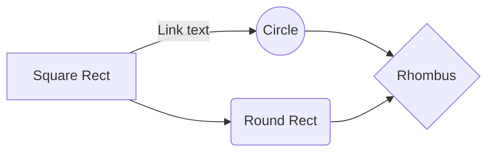
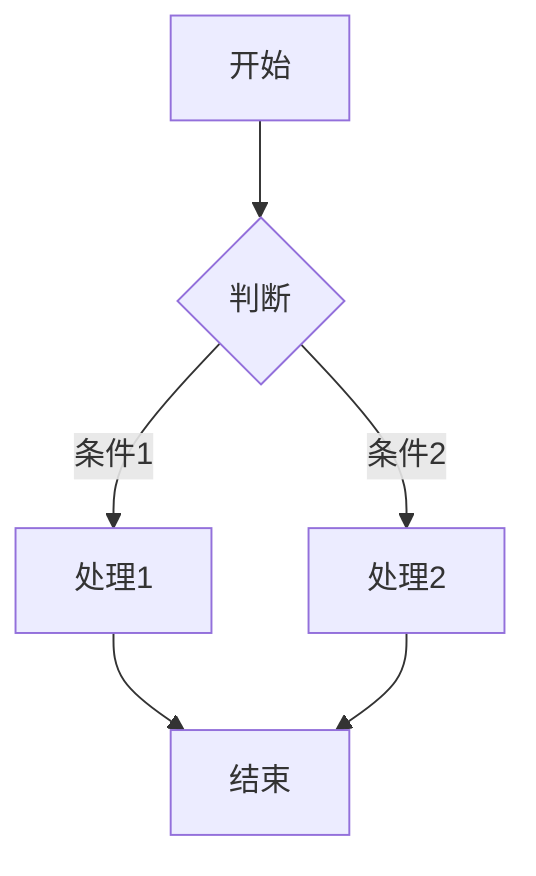
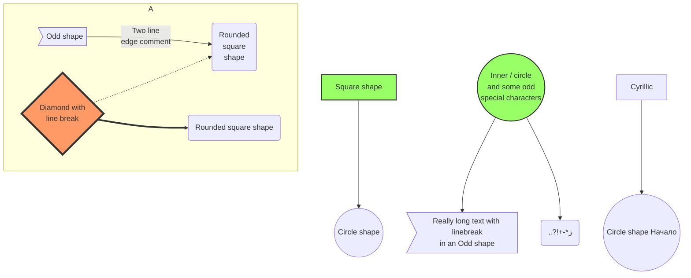
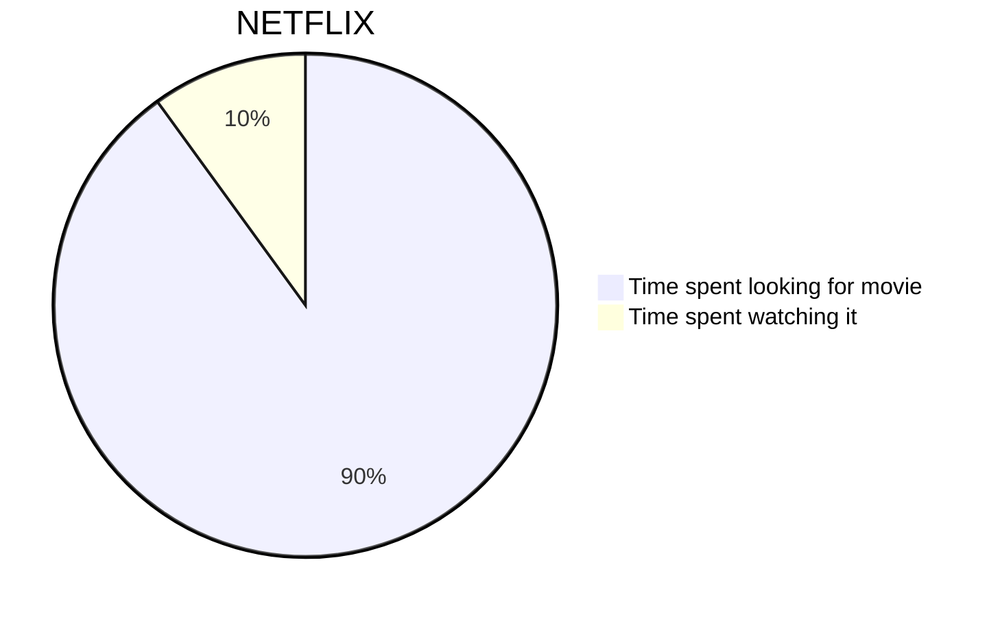
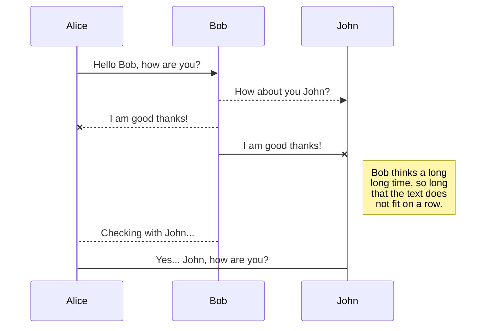
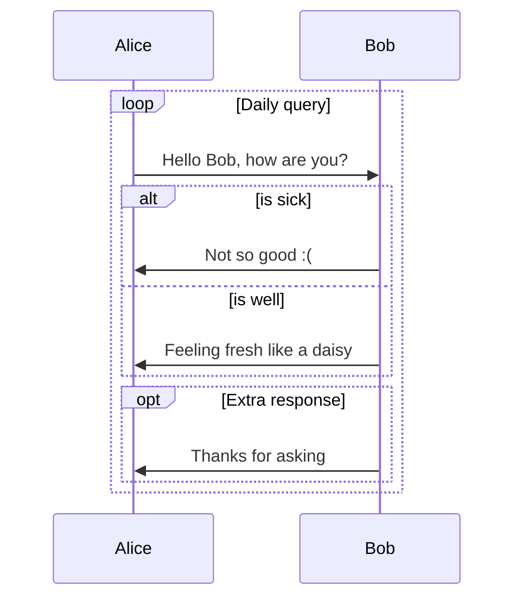
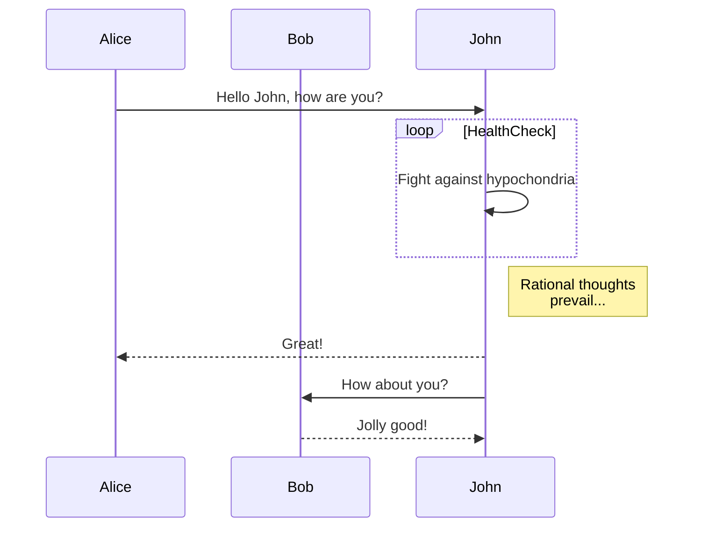
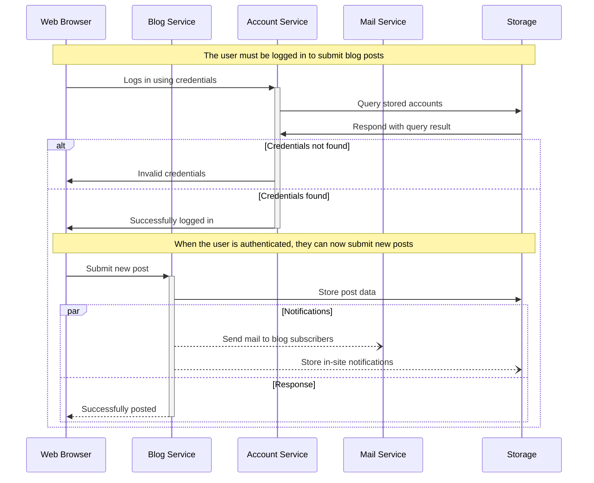
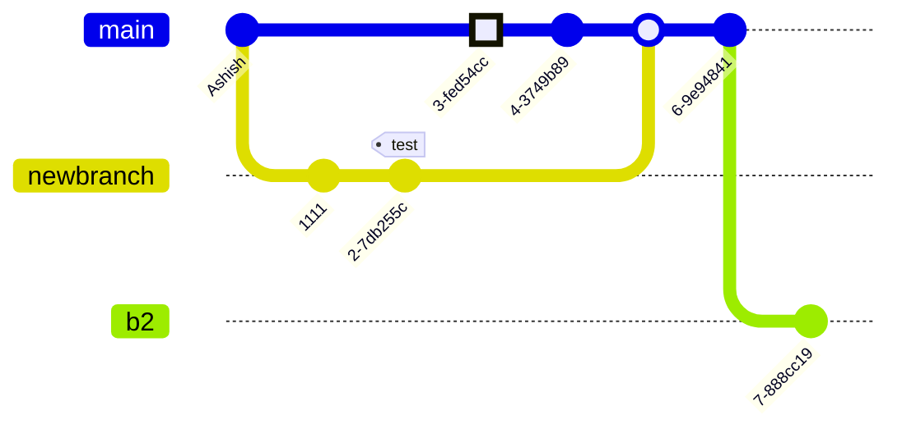

---
tags:
    - 测试
    - markdown
---

# VitePress Markdown 测试

> 这是用于测试 VitePress Markdown 渲染的完整测试文章

## 标题测试 H2

### 标题测试 H3

#### 标题测试 H4

这是普通段落文本，用于测试基础渲染。

## 文本格式

**粗体文本** 和 *斜体文本* 和 ***粗斜体***

~~删除线文本~~

`行内代码文本`

==高亮文本==

## 链接

[链接到首页](/)

## 列表

### 无序列表

- 列表项 1
- 列表项 2
  - 嵌套列表项 2.1
  - 嵌套列表项 2.2
- 列表项 3

### 有序列表

1. 第一项
2. 第二项
3. 第三项
   1. 嵌套有序列表
   2. 嵌套有序列表

## 任务列表

- [x] 已完成任务
- [ ] 未完成任务
- [ ] 另一个任务

## 引用块

> 这是引用块的第一行
> 这是引用块的第二行
>
> 可以有空行分隔
> 引用块支持多行

## 代码块

### 无语言标识

```
这是一个没有语言标识的代码块
用于测试基础代码块渲染
```

### JSON

```json
{
  "name": "test",
  "version": "1.0.0",
  "dependencies": {
    "vue": "^3.0.0"
  }
}
```

### JavaScript

```javascript
const greeting = 'Hello, World!';

function add(a, b) {
  return a + b;
}

class Calculator {
  constructor() {
    this.result = 0;
  }

  add(a) {
    this.result += a;
    return this;
  }
}

export { greeting, add, Calculator };
```

### TypeScript

```typescript
interface User {
  name: string;
  age: number;
}

type Status = 'pending' | 'active' | 'closed';

function processUser(user: User): Status {
  if (user.age < 18) {
    return 'pending';
  }
  return 'active';
}
```

### Python

```python
def fibonacci(n):
    """计算斐波那契数列"""
    if n <= 1:
        return n
    return fibonacci(n - 1) + fibonacci(n - 2)

class DataProcessor:
    def __init__(self, data):
        self.data = data

    def process(self):
        return [x * 2 for x in self.data]
```

### Go

```go
package main

import "fmt"

func main() {
    message := "Hello, Go!"
    fmt.Println(message)
}

type Config struct {
    Name string
    Port int
}
```

### 带有标题的代码块

```typescript [config.ts]
export default {
  title: 'My Site',
  themeConfig: {
    nav: [
      { text: 'Home', link: '/' }
    ]
  }
}
```

### 带有行号和语言的代码块

```javascript {3-5}
function calculate(items) {
  const result = items.reduce((sum, item) => {
    return sum + item.value;
  }, 0);
  return result;
}
```

## 表格

| 表头1 | 表头2 | 表头3 |
|-------|-------|-------|
| 单元格1 | 单元格2 | 单元格3 |
| 单元格4 | 单元格5 | 单元格6 |
| 单元格7 | 单元格8 | 单元格9 |

## 自定义容器

::: info
这是一个信息容器
:::

::: tip
这是一个提示容器
:::

::: warning
这是一个警告容器
:::

::: danger
这是一个危险容器
:::

::: details
这是一个可展开的详情容器
:::

## 数学公式

行内公式: $E = mc^2$

块级公式:

$$
\int_{-\infty}^{\infty} e^{-x^2} dx = \sqrt{\pi}
$$

## 图表 / Mermaid

### 基础流程图 Basic flowchart



### 中文流程图



### 带样式的大型流程图 Styled flowchart



### 基础饼图 Basic pie chart



### 基础时序图 Basic sequence diagram



### 时序图：循环、条件分支 Loops, alt and opt



### 时序图：自身消息 Message to self in loop



### 时序图：博客服务通信 Blogging service communication



### Git 提交流程图 A commit flow diagram




## 图片


## 水平分隔线

---

## 脚注

这是一个带脚注的句子[^1]。

[^1]: 这是脚注内容

## 上标和下标

H~2~O 是水

E = mc^2^ 是质能方程
