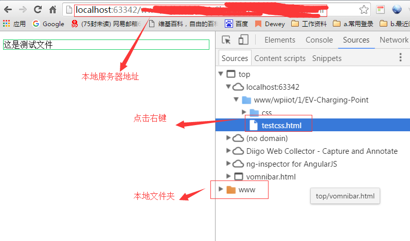
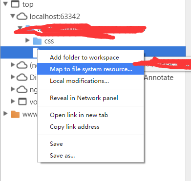
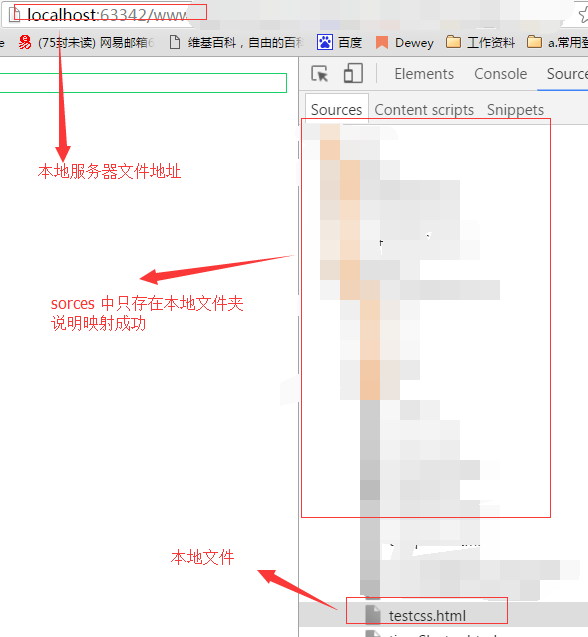
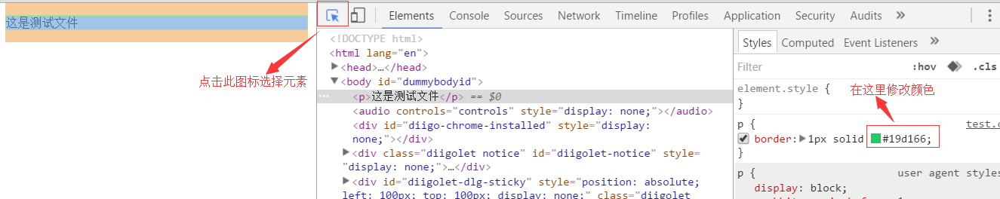
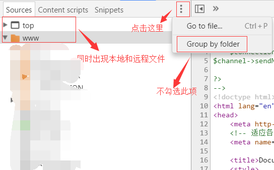
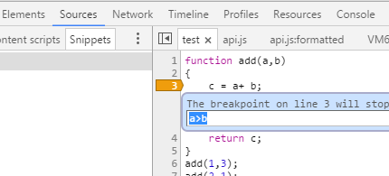
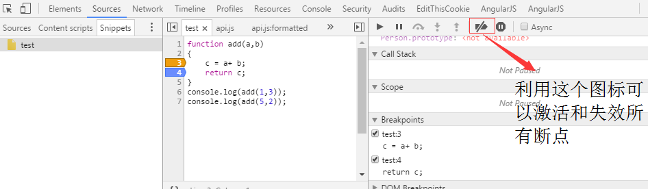

# source 面板

**详解 source 面板使用**

## Filesystem
利用文件系统实现本地代码和浏览器映射.

### 映射本地代码
在配置好编辑器后我们需要利用浏览器查看项目效果，将项目添加到 google 的工作空间中，
可以在浏览器上直接微调属性，并保存到本地工程。   

1. 添加项目
    1. 按`f12`打开控制台，点击`souce`工具，在空白模板中
    点击鼠标右键，选择添加工作空间。
    
    2. 在本地或服务器端打开你添加的工程，选择一个文件点击右键，选择映射到本地文件系统。
    
    
    3. 重新刷新页面本地服务器网页引射到了本地文件。
    
    4. 在浏览器中修改样式，会发现样式表中的文件也会自动改变
     
     
    注意事项 
    1. 远程服务器和本地操作方法相同
    2. 所有在浏览器上的更改只对本地映射文件有效
    3. 对样式的修改只对外部样式表有用，内联样式不会改变本地文件
    4. 不需要保存，修改会自动同步到本地文件

2. 在完成添加项目按图示操作

3. 右键点击任意文件夹或文件可以看到增加文件，删除文件等功能

4. 利用`ctrl+shift+f` 可以快速调出查找功能，搜寻文件或文件中的内容
    
5. 理解[css&js预处理和文件映射过程](https://developers.google.com/web/tools/setup/setup-preprocessors?hl=en)

## Snippets
该选项用于创建可复用的代码片段.
使用步骤如下
 
1. 点击 sorce->Snippets->点击 `New snippet` 创建片段(可在片段上点击右键,选择重名名等操作)
2. 在片段中中填入 js 代码，按 `⌘ + s` 保存代码

    > **tip**
    > windows 下将 `⌘` 替换为 `ctrl` 后不赘述

3. 编辑完成,输入 `⌘ + enter` 执行代码,在片段上点击右键选择执行.

更详细资料参见
[google 原文地址](https://developers.google.com/web/tools/chrome-devtools/debug/snippets/?hl=en) .

## 调试代码
屏幕下方的括号美化 js

### 1. 断点操作   
**JS 中的断点设置**    

**设置断点**  
在 source 模式下，点击行号即可设置断点，注意若在行号上点击右键，会有`edit breakpoint`选项，点击它，你可以改变断点的触发条件，这时断点会变成金黄色。   
   
**关闭断点**       
在点击行号时，你也可以选择`disable breakpoibt` 来关闭断点，这时断点颜色会变暗。   
或者利用`remove breakpoint` 和 双击行号，来取消断点此外在，调试窗口的右边，
里也可以看到所有设置的断点，点击右键同样可以进行设置   
   
除了使用`deactive breakpoint`和`diable all break point`来打开关闭所有断点以外，
利用图中的小标记也可以实现上述效果。记住它的快捷键是**ctrl + f8** 

> 使用情景
1. 在关键地方设置断点，并编辑断点条件
2. 设置好断点后运行代码
3. 利用`F8`运行到下一个断点，也可组合使用`F10`单步或`F11`跳入函数内部
4. 在调试过程中利用`watch,stack`等窗口观察变量的状态
5. 利用`ctrl + f8`取消断点，或利用`F5`刷新页面重新调试。

**DOM 断点设置**
前端在调试界面，或者分析网页的时候，会期望能够在元素设置断点，步骤如下。   
进入元素工具栏，在你需要设置断点的元素位置点击右键，有三种模式可以选择   
* subtree modifications   
当选中节点的子元素结构发生变化时触发，**注意只是结构**,所以子节点的属性更改不会触发该选项。

* attribute modifications
当选中元素的元素属性发生变化时   

* node removal
当前选择的元素发生移除时触发   

所有设置的断点，在`dom breakpoint` 中都可以查看，点击右键有删除 DOM 断点的选项
 
在 souce 模板中也可以看到该选项   
   
在上面的模板上，你同样可以使用， XHR 设置断点和事件监听断点来调试代码。  
其中利用`event listeners`也可以查看错误等事件的绑定函数。   

## 使用 devDocs 离线存储失效
1.  使用 app.db.reset() 进行复位
  
可以将应用添加到桌面。
设置方法参见[知乎](https://www.zhihu.com/question/22103329).
设置完成后在应用上点右键创建快捷方式，将快捷方式添加到启动项中。
就可以通过加载器立即打开。
