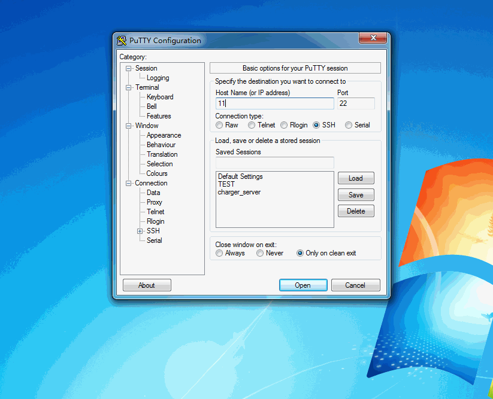
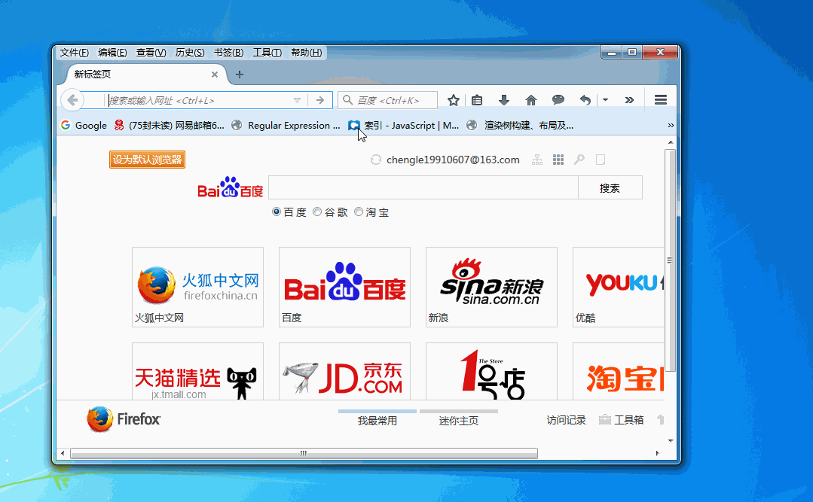

# putty

**前言:讲解 putty 的使用**

---

## 利用 putty 实现利用远程服务器建立 tunnel 通道
1. 打开 putty 界面进行配置
    1. 配置会话选项填写远程服务器地址
    2. 选择 ssh -> tunnel 
        1. Destination 选择 Dynamic 和 Auto
        2. Source port 选择 1024 端口 点击添加
    3. 重新回到 session 点击连接
    
    

2. 打开 firefox 选择工具 -> 选项
    1. 选择高级 ->  网络 -> 设置
    2. 选择手动配置 -> SOCKS 主机 
        填入 localhost 1024 端口
    3. 点击确定后即可利用远程服务器作为 tunnel 通道实现访问。

	

