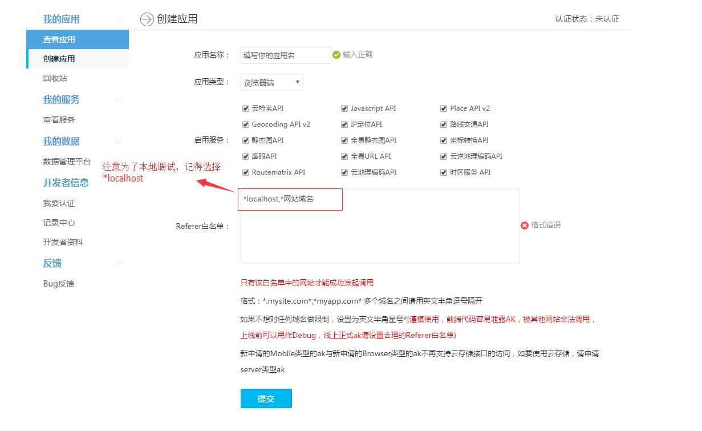

# 百度地图


**前言:讲解百度地图的使用**

---

# 概述
## 快速入门
这里讲解如何在 web 中使用百度地图 API.
1. 进入百度地图网站 [申请秘钥](http://lbsyun.baidu.com/)
2. 创建应用 
3. 在界面中包含 js 脚本，其余加载方式详见 [百度 js 说明](http://lbsyun.baidu.com/index.php?title=jspopular/guide/introduction#.E8.8E.B7.E5.8F.96JavaScript_API.E6.9C.8D.E5.8A.A1.E6.96.B9.E6.B3.95)

    ```html
    <script src="http://api.map.baidu.com/api?v=2.0&ak=您的密钥" type="text/javascript"></script>
        
    ```

4. 在界面中创造放置地图的元素
    
    ```html
       <div id="map" style="width:500px;height:320px"></div>  
    ```
5. 使用百度 js 对象创建地图
    ```html
       <script>
           /** 不要加 `# 号`，直接填入 id 名即可
            *  1. 创建 地图对象
            */
        
           var map = new BMap.Map("map"); 
          
          // 2. 创建坐标点 地理坐标点，经度:116.404，纬度:39.915
          var point = new BMap.Point(116.404, 39.915);          
          
          // 3. 地图初始化,15 表示地图比例的显示级别
          map.centerAndZoom(point, 15);
       
         // 4. 配置地图参数 过两秒后，将地图中心点移到经度:116.404，纬度:39.918 的地方 
         window.setTimeout(function(){  
             map.panTo(new BMap.Point(116.409, 39.918));    
         }, 2000);
       </script>     
    ```
    
## 基本概念
开发地图应用时相关术语如下。

名称|作用|
:---|---|
控件|控制地图显示属性的小组件，例如定位，比例尺等|
覆盖物|叠加到地图上的显示称为覆盖物，例如目的地标记等|


### 控件
百度支持的基本控件

类名称|作用|
:---|---|
Control |抽象基类，所有控件均继承此类
NavigationControl |平移缩放控件，实现平移缩放
OverviewMapControl|缩略地图控件，实现可折叠的缩略地图
ScaleControl|比例尺控件，显示地图的比例关系
MapTypeControl|地图类型控件，显示地图的比例关系
CopyrightControl|版权控件
GeolocationControl|定位控件

> **控件操作**

1. 添加控件

    在实例化地图对象后使用 `addControl` 方法添加控件
    ```js
       // 添加平移缩放控件
       map.addControl(new BMap.NavigationControl()); 
    ```

2. 配置控件
    1. 更改位置
    2. 修改大小
    
> **自定义控件**

自定义控件，需要继承控件的基类。
构造器中必须包含如下属性   

* defaultAnchor 设置控件位置
* defaultOffset 设置控件偏移

参照百度说明，定义单击放大两个图像级别控件。

1. 设置构造函数

    ```js
       // 定义一个控件类，即function    
       function ZoomControl(){    
           // 设置默认停靠位置和偏移量  
           this.defaultAnchor = BMAP_ANCHOR_TOP_LEFT;    
           this.defaultOffset = new BMap.Size(10, 10);    
       }    
       // 通过JavaScript的prototype属性继承于BMap.Control   
       ZoomControl.prototype = new BMap.Control(); 
    ```

2. 初始化控件
    
    ```js
    // 自定义控件必须实现initialize方法，并且将控件的DOM元素返回   
    // 在本方法中创建个div元素作为控件的容器，并将其添加到地图容器中   
    ZoomControl.prototype.initialize = function(map){    
    // 创建一个DOM元素   
     var div = document.createElement("div");    
    // 添加文字说明    
     div.appendChild(document.createTextNode("放大2级"));    
     // 设置样式    
     div.style.cursor = "pointer";    
     div.style.border = "1px solid gray";    
     div.style.backgroundColor = "white";    
     // 绑定事件，点击一次放大两级    
     div.onclick = function(e){  
      map.zoomTo(map.getZoom() + 2);    
     }    
     // 添加DOM元素到地图中   
     map.getContainer().appendChild(div);    
     // 将DOM元素返回  
     return div;    
     }    
    ```
    
3. 添加自定义控件

   ```js
       map.addControl( new ZoomControl()); 
   ``` 


### 覆盖物
覆盖物有如下几类

对象名|作用|
:---|---|
Overlay|覆盖物的抽象基类，所有覆盖物继承此基类|
Marker|标注地图上的点，可自定义图标形状|
Label|地图上文本标注，可自定义文本内容|
Polyline|地图上折线|
Polygon|地图上多边形，可自定义填充色|
Circle|地图上原型区块|
InfoWindow|地图上信息窗口,同一时刻只能有一个信息窗口显示|
    
> **覆盖物使用**

类似空间，使用`addOverlay`添加覆盖物
```js
   //初始化覆盖物添加坐标
   var point = new BMap.Point(116.404, 39.915);    
   //添加覆盖物
   map.addOverlay(new BMap.Marker(point));   
```
   
> **自定义覆盖物**

```js
   function addMarker(point, index){  // 创建图标对象   
   var myIcon = new BMap.Icon("ev_charger.png", new BMap.Size(25, 25), {    
   // 指定定位位置。   
   // 当标注显示在地图上时，其所指向的地理位置距离图标左上    
   // 角各偏移10像素和25像素。您可以看到在本例中该位置即是   
      // 图标中央下端的尖角位置。    
      offset: new BMap.Size(10, 25),    
      // 设置图片偏移。   
      // 当您需要从一幅较大的图片中截取某部分作为标注图标时，您   
      // 需要指定大图的偏移位置，此做法与css sprites技术类似。    
      imageOffset: new BMap.Size(0, 0 - index * 25)   // 设置图片偏移    
    });      
   // 创建标注对象并添加到地图   
    var marker = new BMap.Marker(point, {icon: myIcon});    
    map.addOverlay(marker);    
   }    
   // 随机向地图添加10个标注    
   var bounds = map.getBounds();    
   var lngSpan = bounds.maxX - bounds.minX;    
   var latSpan = bounds.maxY - bounds.minY;    
   for (var i = 0; i < 10; i ++) {    
    var point = new BMap.Point(bounds.minX + lngSpan * (Math.random() * 0.7 + 0.15),    
                               bounds.minY + latSpan * (Math.random() * 0.7 + 0.15));    
    addMarker(point, i);    
   } 
```


## 参考资料 
* [百度工具包](http://lbsyun.baidu.com/index.php?title=open/library)   
* [百度地图示例](http://lbsyun.baidu.com/jsdemo.htm#c1_14)
* [地图类参考](http://wiki.lbsyun.baidu.com/cms/jsapi/reference/jsapi_reference.html) 

