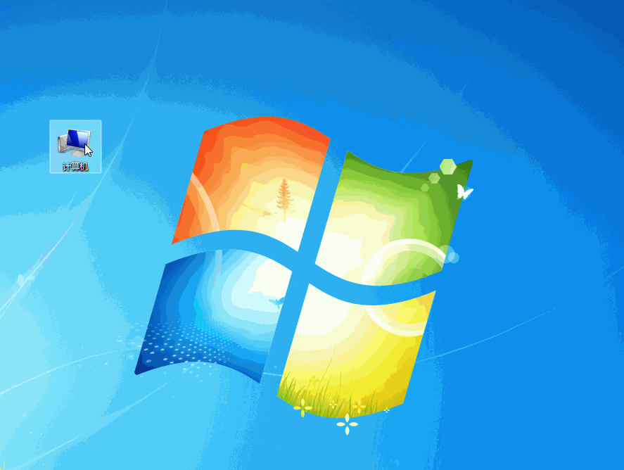

# samba

**前言:讲解搭建 samba 文件服务**

---

## 概述
利用 samba 可以搭建在 windows 下可访问的文件服务。
使用`apt-get install sambat`命令进行安装。
安装完成后跳转到`vi /etc/samba/smb.conf`文件下
可以在[samba配置项说明](https://www.samba.org/samba/docs/man/manpages/smb.conf.5.html)
查看详细配置。

利用 windows 进行连接时，使用网络驱动器实现盘符挂载



## 遇到问题

### windos 不显示文件映射

在使用时 windows 无法正常显示映射路径。
重新注销后再次登录即可。

### 不同用户进行映射
1. win7 系统修改 `C:\Windows\System32\drivers\etc\hosts` 文件
	```md
		<ip 地址> <dns 映射> <别名1> <别名2>..
	```
1. 连接的时候利用别名进行连接
	[多用户登录](http://superuser.com/questions/95872/sambawindows-allow-multiple-connections-by-different-users)
3. 连接时使用 `\\<别名>\<文件路径>` 进行连接