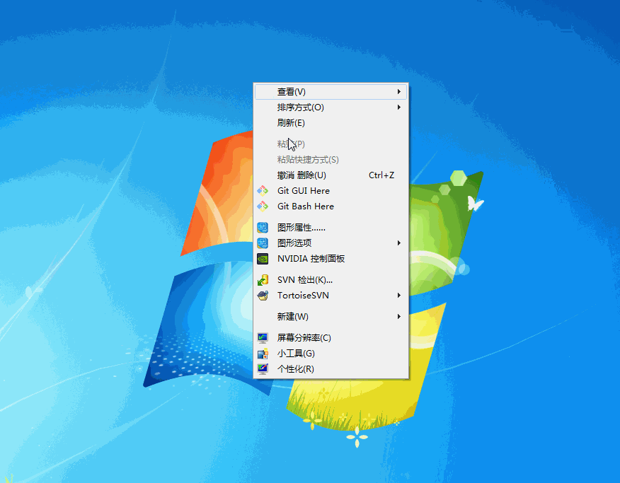

---   
tag: windows   
birth: 2016-8-22 09:05:51   
modified: 2017-2-21 16:21:44   
---

# windows 使用技巧

**前言：讲解使用 windos 系统的经验**

---

## windos 环境配置
### 任务管理器

双击空白区域会隐藏工具栏。
[任务管理器最小化模式](https://support.microsoft.com/en-us/kb/193050)

### 运行命令框

利用 `windows + r` 进入运行对话框,你可以在对话框中输入你想要打开的软件名，
在打开运行后，利用 `f4` 可以查看最近的指令
举例：   
```txt
#  打开绘画工具
mspaint 

#  打开资源管理器
resmon 

#  任务管理器
taskmgr 

#  打开计算器
calc 

#  打开 dos 命令窗口
cmd 

#  打开photoshop，如果你已经安装了的话
photoshop 

# 打开记事本
notepad 

# windows 自带截图工具
snippingTool 

# 打开设备管理器
devmgmt.msc  

# 打开环境变量配置
sysdm.cpl

# 打开服务管理
services.msc

```
可以利用运行窗口快速启动不同软件配置如下。
   
## 软件
### powershell
windows 下新版 shell

### everything
实现快速的文件查找。

[everything 常见问题](https://xbeta.info/everything/faq.htm#How_do_I_use_regex)

### [Chocolatey](https://chocolatey.org/) 
实现利用命令进行软件安装
常用命令。

```bash
# 更新自身
choco upgrade chocolatey 
```

### notebook
多方同步工具。
在使用时注意新的笔记本需要打开后才可使用。
若无法同步先去远程服务器查看服务器端是否有结果。
[资料](https://xbeta.info/everything/faq.htm#How_do_I_include_spaces_in_my_search)

### synergy
实现一套键鼠控制多台电脑

## 使用技巧
### 外界显示器配置




### 更改系统盘符
1. 右键点击计算机->管理->磁盘管理
2. 选择对应磁盘->更改驱动器号和路径
3. 选择新的驱动器号即可


## dos 命令
### systeminfo
功能：显示 windows 系统参数

### ver 
功能：显示系统版本

### netstat
功能：显示网络连接  

举例：
```bash
# 查看 tcp 会话状态
netstat  -p tcp  //查看 tcp 会话状态
# 显示某会话
# -a 显示所有网络会话
# -o 显示进程 id
# -n 显示序号
# 查询端口 8080 设计的进程信息
netstat -nao | findstr 8080
```

### findstr
查询字符串内容


### SET

设置环境变量

**范例:** 

```bash
# 设置环境变量
SET <env_name> = <value>

# 清空该变量
SET <env_name> = 

# 追加变量
STE <env_name> = %<env_name>%;<add_value>

# 显示变量,不存在会报未定义
SET <env_name> 
```

### start
启动一个命令行窗口
```
   start . //打开当前工作目录 
   start xx //打开应用，应用可以简写后放在 windows 目录下实现 
   start . //打开当前工作目录 
```

可以使用该命令执行 windows 脚本，后缀为 `.cmd` 的文件。

```cmd
   # 文件名
   start /B <command_file_name>  
```

### tasklist
显示当前任务
```dos
   tasklist /fi "imagename eq chrome*" //查找所有和 chrome 有关的进程 
   tasklist /fi "memusage gt 50000"  //查找占用内存超过50000kB 的进程
```


### taskkill
终止当前进程
```dos 
   taskkill /im chrome*  //杀死所有和 chrome 有关的进程
```

### type
显示文件内容

### select-string

类似 linux 下的 grep 指令。

```bash
# 显示对应的 tcp 连接
netstat -tno | select-string ":1111*"  
```


## net 

用来停止和重启网络服务

```bash
# 开启服务
net start <server_name> 

# 停止服务
net stop <server_name> 
```

**注意若使用命令时报 error 5 ，说明需要使用管理员权限执行此命令**

## 快捷键  
### 窗口控制
* `alt + f4` 关闭窗口
* `ctrl + w` 关闭当前窗口
* `shift + 应用图标` 在新窗口打开应用
* `ctrl + shift + esc`  迅速打开任务管理器
* `win + break`  快速打开系统信息
* `win + p`  切换扩展屏模式
* `win + B`  定位到任务栏，系统工具
* `win + n` 打开任务对应窗口，`n = [1-9]` 均可
* `win + T` 预览任务栏应用
* `win + SPACE` 显示桌面
* `ctrl + shift + 鼠标左键 + 应用图标` 管理员方式打开应用

### 文件夹相关
* `alt + ↑ | ← | →` 父级和子级文件夹之间的切换
* `shift + 鼠标右键` 可以在此处打开命令窗口
* `ctrl + shift + n`   新建文件夹
* `ctrl + d`   删除文件夹
* `f2`   重命名文件
* `alt + d`   删除文件夹
* `鼠标` 同分区移动文件是剪切粘贴。
* `ctrl + 鼠标` 同分区复制文件 
* `鼠标` 不同分区复制文件 
* `shift + 鼠标` 不同分区剪切粘贴文件 
* `alt + 鼠标` 创建快捷方式 

## windows 环境变量详解

> PATH

path 在查找时，会根据顺序进行搜索。
如果找到了对应路径就不会继续查找。
在安装多个版本的软件时可以利用这个特性实现对版本的访问控制。

`PATH=c:\python\2.5;c:\python\2.6` 此时会默认使用 2.5.
`PATH=c:\python\2.6;c:\python\2.2` 此时会默认使用 2.6.

## 软件安装

使用 windows 进行软件安装时，若出现缺少某组件。
按照如下思路解决。
1. 可能是已安装该安装包，但是非官方资源软件无法识别。
2. 未安装该安装包


解决步骤

> 问题 1

1. 利用 `windows + r` 打开运行窗口输入 `control panel` 打开控制面板选择`程序和功能`
2. 在程序中查找对应的安装包，若存在但是安装显示错误，就先卸载。
3. 若无法直接卸载利用`windows clean up` 工具进行。
4. 卸载完后重新安装软件

> 问题2

1. 直接去官网下载对应安装包
2. 重新安装即可

## 虚拟光驱使用
对于 iso 的镜像文件，先挂在为虚拟光驱在进行运行。


## 微软软件的使用
### excel2007 的使用

> **行操作**

   

* `ctrl + shift + +` 插入一行
* `ctrl + -` 删除一行
* `f4` 重复上一步操作
* 选中行后利用左下角实心点拖动即可


> **选项卡**

1. 选中需要添加选项框的单元格
2. 点击 数据 -> 数据有效性
3. 选择序列模式
4. 在来源中将多条选项利用英文逗号隔开即可

**注意勾选提供下拉箭头**

> **条件格式**

1. 选择需要设置条件格式的单元格
2. 点击 开始 -> 条件格式 -> 管理规则
3. 新建规则,根据需求选择对应规则类型
4. 完成规则描述,选择对应的填充样式
5. 点击确认规则样式即可被运用到对应的单元格

> **条件筛选**

1. 选择要进行筛选的列
2. 开始 -> 排序和筛选 -> 筛选
3. 点击筛选的下拉框进行选择即可

**利用条件筛选可以满足大部分的需求**

> **甘特图**

[甘特图画法](https://www.zhihu.com/question/20995941)

> **分行求最值**

[数组模式](http://stackoverflow.com/questions/20269814/how-do-i-get-the-max-value-from-the-sum-of-two-columns-in-excel)

> **合并单元格**

* 使用 `=<单元格1>  <单元格2>'`

### 连接运算
使用 `<单元格> & "<字符串内容>"` 的模式连接内容
   

   

## outlook

### 设置邮箱签名

1. 新建邮件,点击签名
2. 创建签名,名称和内容
3. 设置签名在新邮件中使用

### 添加联系人
1. 点击联系人
2. 创建通讯录
3. 选择联系人即可

## 系统备份还原升级详解
### 升级
#### 硬件配置查看
1. 查看支持最大内存

```bash
# 进入 cmd 控制台 
wmic memphysicla get maxcapacity


# 返回值除以 1024*1024 即为最大支持内存容量
```

1. [华硕拆机查看](http://detail.zol.com.cn/386/385547/article_eva_53_91.shtml)

 
 
#### 安装固态硬盘

固态硬盘选购技巧

[知乎详解](https://www.zhihu.com/question/20369676)


1. 使用 [ahci 模式](http://jingyan.baidu.com/article/08b6a591fee1c214a9092210.html)
   
## 重装系统

### 启动 u 盘
启动 u 盘 有两种类型.
* uefi 适用于 2012 之后的电脑,是一种新的启动方式
* u 盘启动,对于较旧电脑不具有 uefi 的 bios 启动方式.
此时需要使用 u 盘启动.手动设置实现启动功能.

### pe 使用
1. 配置好 pe 启动盘
2. 利用 pe 启动盘配置好系统
3. 格式化固态硬盘
    1. 尽量减少分区数量
    2. 扇区设置为 4096 对齐
    
**注意 windows 光盘默认不带有驱动,所以在固态分区后,请先将网卡驱动和驱动精灵拷贝到
非系统盘,后续方便进行系统安装**

4. 重启计算机,按 esc 进入启动引导.注意不同品牌的启动引导可能不同.
参见如下.


5. 在 bios 配置界面将 sata 接口配置为 AHCI 模式,此模式会提升固态硬盘的读写速率.

6. 选择 bios 启动项,若为光盘安装则直接选用 dvd 模式,若为 ep,则选择对应的安装镜像即可

7. 若安装系统不带有驱动则使用前面拷贝到非系统分区的驱动进行安装.

## 系统备份
### windows 自带备份工具
在备份之前理解如下概念
* **驱动器** 表示被格式化的存储设备例如光盘，硬盘，软盘等
* **系统镜像** 只包含 windows 系统的驱动器（默认包含所有盘符）
* **备份文件** 对需要保存的文件进行压缩处理
* **备份期** 保存整个系统进行的时间节点


1. 点击控制面板选择备份和还原
2. 选择备份，备份方式有三种
    * 本地硬盘
    * 光盘
    * 网络硬盘
3. 选择需要备份的文件和自动备份的时间设定
4. 进行备份即可

**还原系统**

1. 选择备份和还原

利用还原可以对系统文件进行恢复

若要恢复整个镜像.使用高级恢复选择对应的文件即可.

**对于系统镜像不支持网络操作**

**可以使用 windows 进行文件备份实现网络恢复.但是不要备份系统**

**完全还原还是使用 ghost 文件**


### ghost
利用 ghost 实现对硬盘的恢复.
在初始装机时将安装好驱动和更新的系统盘符进行备份.

在使用 pe 启动后直接利用 ghost 文件进行恢复.


### 显示隐藏桌面
1. 点击运行搜索显示
2. 选择显示隐藏图标
3. 点选需要的图标即可


## 操作系统使用经验
1. 使用包管理工具
2. 进一切可能熟悉和精通命令行
3. 尽可能自动化
4. 形成工作流,远离舒适区
   

