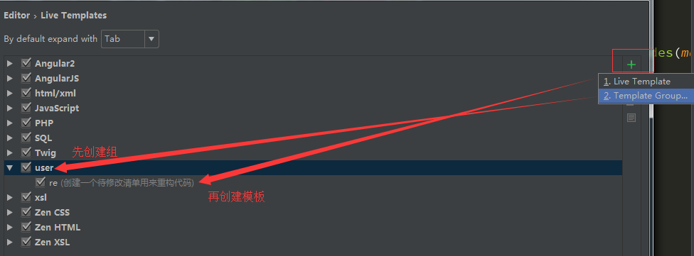
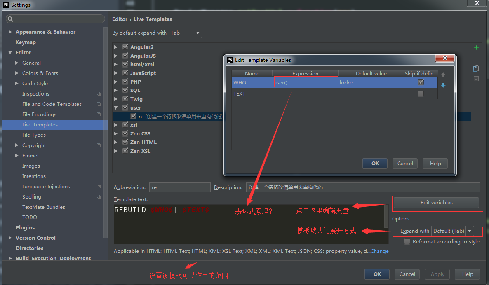
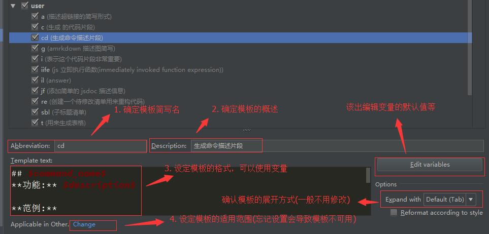
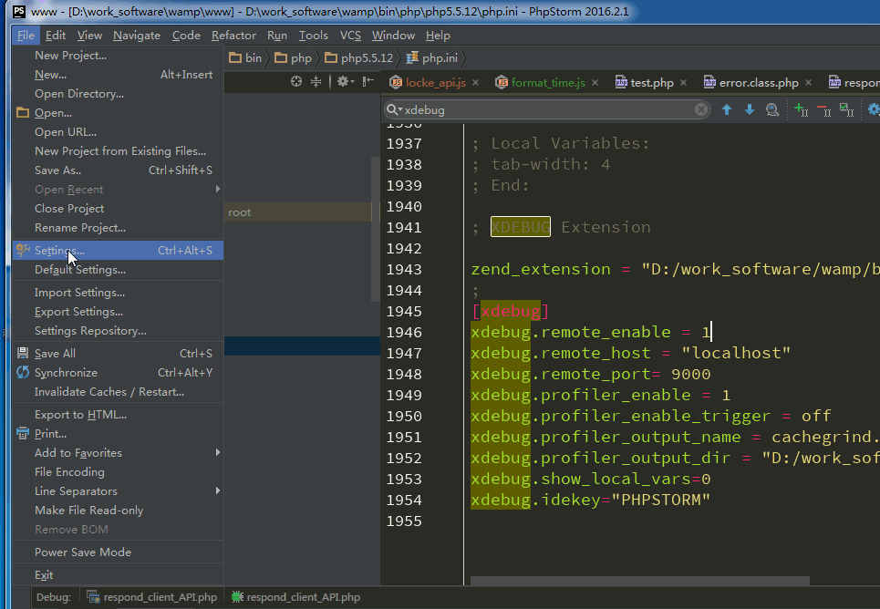
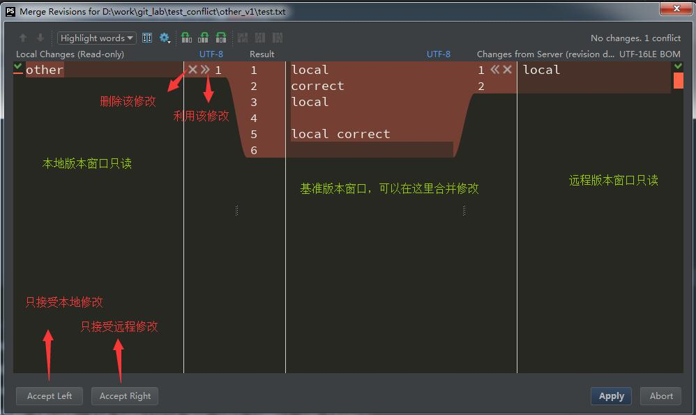
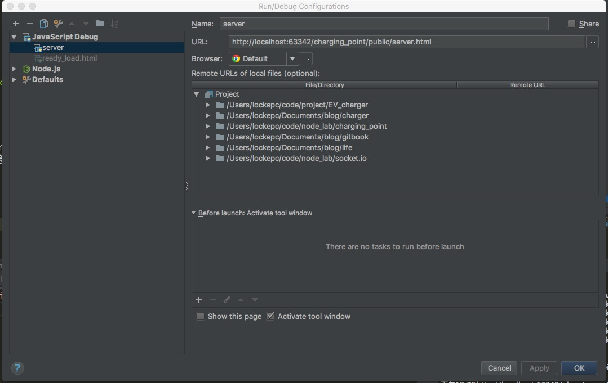
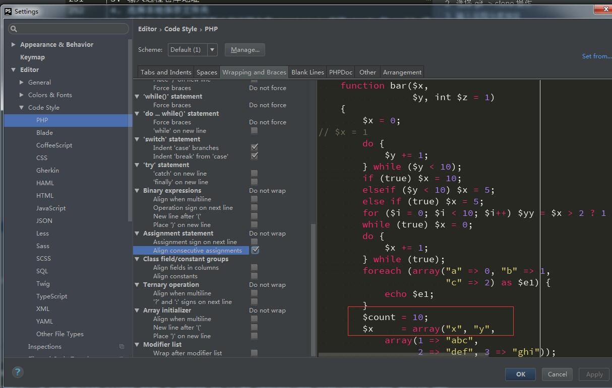
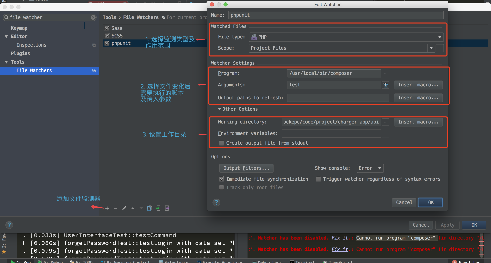

phpstorm 使用指南
===

**前言: 讲解 phpstorm 的使用技巧**

---


## 概述
笔者将 phpstorm 使用总结如下

* `环境配置` phpstrom 的常用配置
* `快捷键` 笔者常用的快捷键进行了分类整理
* `工具` 讲解笔者在使用中常用 phpstorm 功能
* `其他` 总结使用经验及其他内容
    

## 配置工作环境
phpstorm 中大部分配置均在 `file -> Default Settings` 中完成.
对应快捷键:
* `⌘ + ,` mac 环境
* `ctrl + alt + s` windows 环境

> 该快捷键在后续描述中不会强调,但非常重要!

### 主题配置
1. 选择主题 [phpstorm 主题网站](http://www.phpstorm-themes.com/)
2. 根据机型选择配置文件
    * `MAC`  选择 `.icls`   
    * `WINDOWS` 选择 `.XML`   
3. 替换主题,参照[主题帮助说明](http://www.phpstorm-themes.com/content/help)    
4. 选择主题


    
    
### 设置键盘映射风格
phpstorm 在 mac 和 windows 默认快捷键有区别.
通过设置 `keymap` 可保证统一性.
 
* `ctrl + '`(注意是反引号) 选择 keymap 设置对应的快捷键风格

###  依赖工具
* 配置 SVN 的工作环境   
在 `settings -> version_control -> subversion` 中设置 svn.exe 的安装路径

* 配置 git    
在 `settings -> version_control -> git` 中设置 git.exe 的安装路径
    
* 添加浏览器   
    1. 打开设置
    2. 搜索  browser,添加新浏览器路径

### 插件安装
在设置界面搜索 plugins ,打开搜索各种插件.笔者使用插件如下

* `key prompert` 提醒使用键盘快捷键的工具
* `IdeaVim` 开启 vim 模式的编辑器
* `BashSupport` 支持 shell 的高亮
* `settings repository` 实现多台电脑的配置同步 **注意在同步配置后,涉及到路径的配置,在不同电脑上时需手动修复**
* `live edit` 配合 chrome,实现同步编辑


### 配置导出
当多人使用工具时要保证生产环境的同步常用同步方法如下

1. 导出导入设置
[如何导出和导入配置文件](https://www.jetbrains.com/help/phpstorm/2016.2/exporting-and-importing-settings.html)

2. 共享配置文件
[共享配置文件说明](https://www.jetbrains.com/help/phpstorm/2016.1/sharing-your-ide-settings.html)

### wamp 关联 phpstorm
1. 打开配置界面
2. 参照如下 gif [wamp关联 phpstorm](../img/2018-08-10-phpstorm_wamp.gif)


## 快捷键

以 windows 模式下举例.若要查找快捷键.
打开设置面板,搜索 `keymap` 再查找对应快捷键即可.

### 控制光标位置
* `ctrl + m` 将光标定位到文件中心
* `alt + j` 多列模式进行选中,只会选择相同的单词
* `alt + shift + j` 取消多列模式
* `ctrl + shift + m` 匹配括号的位置，会将光标移动到对应正括号和反括号位置
* `ctrl + [ 或 ]` 具有相似功能
* `ctrl + shift + [ 或 ]` 可已选中对应的括号区域
* `ctrl + pageup` 将光标移动到页面顶头
* `ctrl + pagedown` 将光标移动到页面底部
* `ctrl + g`  输入`:行号:列号`快速定位文件位置

### 编辑文档
**删除**
* `ctrl + y` 删除一行，删除从
* `ctrl + delete` 删除光标后内容 
* `ctrl + backspace` 删除光标前一个字的内容  
* `ctrl + enter` 在行首会在该行前创建新行，行末会在改行后创建新行

**复制**   
* `ctrl + d` 复制选中块，若没有则只是复制当前行
* `ctrl + shift + v` 粘贴文档时可以选择行数，多选时按住`shift`，也可以显示剪切板历史

**选择移动**
* `ctrl + w` 进行选择扩展,加`shift`反向操作扩展
* `shift + ↑ 或 ↓` 向上或向下移动一行
* `shift + ↑ 或 ↓` 向上或向下选中多行
* `home 或 end`移动到行首或行末
* `shift + home 或 end` 选择光标到行首或行末的内容
* `pageup 或 pagedown` 向上或向下移动一页
* `shift pageup 或 pagedown` 向上或向下选择一页
* `ctrl + shift + [ 或 ]` 选择匹配括号的内容，注意使用时光标要放在括号前后才起作用
* `shift + alt + ↑ 或 ↓` 将光标对应行向上或向下移动，也可以选中多行进行移动
* `shift + ctrl  + ↑ 或 ↓` 对于函数等内容，它是向上或向下移动整个函数
* `ctrl + shift + l ` 格式化代码，再加上`alt` 可以格式化全局
* `alt + shift + insert` 实现按照矩形格式来选择文本的功能

**文件控制**
* `ctrl + b` 跳转到函数 ，或者按住`ctrl` 点击函数也可实现该效果。
* `ctrl + f12` 显示函数之间的结构关系  
* `alt + ↑ 或 ↓` 函数跳转的上下切换
* `ctrl + alt + ←  或 →` 实现前进和返回，但是在windows 中这两个快捷键被用来转换屏幕,所以建议自定义快捷键。
* `ctrl + alt + backspace` 也可实现返回的功能
* `F2` 当出现规则检查错误时进行导航，加`shift`为反向导航，利用`ctrl+f1`查看错误原因,`alt+enter`查看解决办法
* `F6` 和 `F5` 移动和复制文件，在弹出框中写入路径即可
* `ctrl + alt + shift + t`在项目文件树中使用，会出现对文件移动、复制等操作
* `shift + f6` 项目窗口中使用可以重命名文件，在编辑模式下没有作用
* `alt + insert` 新建文件
* `ctrl + shift + f` 在工程中查找内容
* `ctrl + shift + U` 或者 edit | toggle case 修改字母大小写
* `ctrl + -` 收缩当前区块
* `ctrl + +` 展开当前区块
* `ctrl + shift + -` 收缩所有区块
* `ctrl + shift + +` 展开所有区块

**设置与查找**
* `ctrl + n` 全局查找类
* `ctrl + shift + n` 全局查找文件，你可以在查找时追加`:行号:列号`快速定位文件位置
* `ctrl + shift + n` 使用该方法也可以查找目录，只需要在搜索关键字后加上`/`的路径索引符即可
* `ctrl + shift +a` 查找 PHPSTORM 命令的名称，及快捷键，可以迅速执行
* `ctrl + q` 快速查找文档帮助在阅读函数时非常有用
* `ctrl + alt + t` 利用此实现环绕


**设置标签**   
* `shift + f11`,`f11` 设置和清除标签,利用标签来进行文件的修改

**添加注释**
* `ctrl + /` 添加单行注释
* `ctrl + shift +\` 添加多行注释

> 注释模式会随着使用语言自动变化


**高级编辑功能**
* `alt + enter` 在编辑 php 时，若字符串为 HTML 片段，可以利用该功能实现片段代码编写
* `alt + enter` 该命令在不同环境有多种操作非常重要
* `ctrl + alt + m` 在编码时，可以将选择的块新建成函数
* `shift + F6` 在修改函数或文件名的同时，引用该函数或文件的地方也会同时修改
* `ctrl + alt + n` 当光标在函数变量附近时，使用该快捷键会将变量内容变成内联模式

### 工作窗口切换
**项目树和文件之间的切换**
* `alt + f1 + 1` 在全局查找到文件以后，利用该快捷键迅速定位在 项目树中的的位置
* `f4`  实现在查找到的文件和项目树之间进行切换
* `alt+左右方向键` 进行文件切换

**工作窗口切换**
* `ctrl+tab+左右方向键`切换所有工作选项
* `alt + number` 例如 `alt + 打开关闭工程
* `alt + 1` 打开关闭工程文件夹，可以直接在项目树中输入字符进行查找，也可利用上下左右键进行展开
* `alt + 6` 查看 todo 信息
* `alt + 7` 打开函数结构显示
* `ctrl + tab` 切换显示工具栏
* `alt + f12` 快速打开控制台
* `F12` 打开最近关闭的窗口
* `shift + esc` 退出，`esc` 也有退出功能。
* `ctrl + f4` 在非编辑窗口下会退出，在编辑窗口下会关闭当前窗口
* `f4 和 shift +f4` 打开工程文件夹中所在位置的文件，在新窗口中打开
* `ctrl + shift + e`打开最近编辑的文件列表,`ctrl + e`相似
* `alt + home` 迅速回到顶层导航栏位置，利用上下左右箭头切换文件，这是可以利用上下左右键进行切换和展开
* `f2` 导航到下一个错误
* `shift + f2` 上一个错误
* `alt + f12` 打开终端
* `ctrl + shift +t` 在打开终端下创建新终端
* `ctrl + shift +w` 在打开终端下关闭终端

> 拖动工作路径和文件到终端下会创建一个指向该路径的新终端


### 杂项
* `ctrl + j` 查询当前文件支持的自定义模板
* `双击 shift` 显示最近的文件夹,类似 `ctrl + e`


## 工具
### 利用 TODO
**应用场景**
1. 标注你以后有待修改的代码
2. 团队协作时，告诉其他人需要维护的部分
3. 记录代办事项

**使用方法**  

> 单人使用  

利用注释快捷键添加注释,在注释中包含
`todo 描述信息`,以 js 代码举例

```js
//todo 完成 xx 函数重构
```

利用 `alt + 6` 即可查看项目中所有代办事项

> 多人模式

1. 打开设置,搜索 todo,添加新的 todo 模式，
2. 添加过滤器,点击 todo 窗口的漏斗图标就会看到自己的过滤器。
3. 添加 todo 模板
    1. 在 设置选型中设置好新的标记和过滤器
    2. 使用 live template 编辑模板   
    
    3. 编辑模板中的变量   
    

更详细的描参见 [官方帮助](https://www.jetbrains.com/help/phpstorm/defining-todo-patterns-and-filters.html?search=todo)

> 使用建议
   
形成自己的 todo 风格，参考 stackoverflow 讨论([todo 的技巧](http://stackoverflow.com/questions/2944360/tokens-in-visual-studio-hack-todo-any-other))   

```
    红色: 无法编译和运行的代码 
    // Error - 编译或运行时出错的代码
    // Broken - 代码无法运行或发生崩溃
    // WTF - 极度丑陋的代码
   
    橙色: 代码可以运行，但是方法不恰当
    // Hack - 为了使代码能正常运行而添加的黑客方法
    // FixMe - 代码实现了功能但是可以再可维护性、性能等方面进行改善
    // Bug - 代码已上线，但有时会出现 BUG
    // Review - 代码可以正常工作但是需要复审
    // Smells - 类似于修补
   
    蓝色: 代码可以正常运行，但是需要添加特性或补充
    // Todo - 函数还没有完善
    // Note - 解释目前的进展方便其他人
```

### 自定义模板
1. 设置面板中搜索 live template
2. 创建模板组，它的作用是将一组模板放在一起，目的是便于管理，模板组命名可以参考如下规则
    * 根据文件类型建立模板组，比如 md 表示所有 markdown 文件下的模板
    * 只建立一个模板组 locke ,以自己的用户名建立模板组
    * 按照使用场景建立模板组 ，code 表示编程的模板组。
3. 在建立的模板组下创建模板,主要是确定如下方面

    

4. 设置成功后在对应格式的文件中使用 `ctrl + j` 可以查看该文件类型对应支持的模板。
或者直接输入模板的简写，使用 tab 进行扩展。

在使用模板中有一些常用的预定义变量 

phpstorm 内置变量|作用|
:---|---|
$END$|用来确定模板展开后的光标位置|

其余变量参见 [模板变量](https://www.jetbrains.com/help/phpstorm/live-template-variables.html?search=varia)

### 调试代码
重点是理解 phpstorm [run/debug 调试器配置](https://www.jetbrains.com/help/phpstorm/run-debug-configurations.html?search=run/debug)
不同语言需要不同的调试环境.此外需要熟悉 [phpstorm 调试窗口](https://www.jetbrains.com/help/phpstorm/debug-tool-window.html?search=debug)

#### js
参考 [官方调试说明](https://www.jetbrains.com/help/phpstorm/debugging-javascript-deployed-to-a-remote-server.html?search=javascript%20de#d109205e87)

#### html

官方帮助 [liveedit](https://www.jetbrains.com/help/pycharm/2016.3/live-edit.html?search=live%20ed)

1. 首先安装 `liveedit` 插件
2. 安装 JetBrains IDE Support chrome 插件
3. 在 phpstorm 中修改界面,chrome 会同步更新

可以配置  [match pattern](https://developer.chrome.com/extensions/match_patterns)

**可能存在问题**

1. 若无法正常运行查看页面是否有错误
2. 注意配置为 javascript 调试模式

#### php
详细步骤参见 [xdebug 配置](https://confluence.jetbrains.com/display/PhpStorm/Zero-configuration+Web+Application+Debugging+with+Xdebug+and+PhpStorm)

1.  打开设置界面选择 php->interpreter 打开 php.ini

    
    
2. 在打开的配置界面中查找`[xdebug]`，并修改如下配置信息

```ini
[xdebug]
;开启远程调试界面
xdebug.remote_enable = 1 
;设置远程界面地址
xdebug.remote_host = "localhost" 
;开启远程监听端口
xdebug.remote_port= 9000
xdebug.profiler_enable = off
xdebug.profiler_enable_trigger = off 
;xdebug.profiler_output_name = cachegrind.out.%t.%p
;xdebug.profiler_output_dir = "D:/work_software/wamp/tmp"
xdebug.show_local_vars=0
;xdebug 运行环境
xdebug.idekey="PHPSTORM" 
 
```

3. 在 chrome 下安装 xdebug helper,修改 Ide key　为 phpstorm。
4. 在 phpstorm 下选择 run->启动 debug 监听
5. 在 phpstorm 页面中设置断点
6. 在浏览器中开启 xdebug helper 调试后，刷新页面即可

可参考
* [xdebug](https://confluence.jetbrains.com/display/PhpStorm/Validating+Your+Debugging+Configuration)
* [phpstomr xdebug](https://confluence.jetbrains.com/display/PhpStorm/Zero-configuration+Web+Application+Debugging+with+Xdebug+and+PhpStorm)

**坑**

> 9000 端口不可用

php-fpm 占用了此端口,所以注意屏蔽该端口使用 9100 代替即可

#### node

[调试 node 应用](https://confluence.jetbrains.com/display/WI/Running+and+debugging+Node.js+application)


### cvs
1. 选择 VCS 选择版本控制软件
2. 选择 git -> clone 操作
3. 输入远程仓库地址
4. 选择本地保存文件夹
5. 克隆到本地后，利用默认的远程仓库 `origin` 实现 push 和 pull 操作。

利用`配置->版本控制->忽略文件` 添加忽略信息.
详见 [phpstomr 官方忽略文件](https://www.jetbrains.com/help/phpstorm/configuring-ignored-files.html?search=ignore)

也可以使用 `ctrl + 9` 切换到版本控制.
选择图标来忽略文件.

可以利用 phpstorm 解决冲突图例如下



详见 [phpstorm 冲突解决](https://www.jetbrains.com/help/phpstorm/2016.3/resolving-conflicts.html)

## 自动环绕

* `alt + ctrl + t` 可以自动添加各种类型的包围快

 需要进行如下配置


## 利用命令打开文件
1. 选择 `tools -> create command line launcher`
 
2. 点击确认后即可利用

```bash
# 打开文件
pstorm <file_naem> 
``` 

## 查看代码结构
利用 view->toolwindow->structure 查看代码结构

各图标含义如下

[图标含义](https://www.jetbrains.com/help/phpstorm/symbols.html)


## macros
利用 macro 来录制宏.

1. `edit -> macros -> start macro recording` 开始记录宏
2. 执行需要记录的操作
3. `edit -> macros -> stop macro recording`

结束后会要求输入宏名称.
保存后利用 `edit -> macros -> start macro recording` 播放录制的宏

> 可以在 php 设置中为 `macros` 分配快捷键,加快操作

## 其他
### 经验

> 工欲善其事,必先利其器

对于工具的使用笔者的原则为
* `常看帮助` 不会使用的地方先去源头看帮助.不要陷入漫长的查找中
* `多总结,多记录` 对于配置方面的工作,记下来免得下回又要重来
* `不要受限` 当这个工具无法满足你时.请结合其他工具.前提是官方以明确指出没有该特性
 

### 使用问题
#### 缓存
phpstorm 及其占用缓存.当电脑变慢时.
利用 `file -> invalidate caches/restart` 重启应用.


#### 工具栏消失
进入 view 菜单选择 `tool bar` 和 `tool button` 即可。

###  清除无用的 css 样式
1. `code -> run` 或者利用快捷键  `alt + ctrl + shift + i`
2. 输入 `unused css`
3. 选择删除无效的 css 样式

### 文件恢复
1. 右键点击工程文件夹
2. 选择`local hostory`
3. 选择 `show history`
4. 选中想要还原的状态，点击返回箭头即可。

### 文本对齐
1. 键值对对齐
[键值对对齐](http://stackoverflow.com/questions/29795116/stop-phpstorm-from-aligning-associative-arrays)
2. 变量申明对齐



### 修改 index 索引映射
该方法可以节约 `phpstorm` 缓存.
在配置相中打开 `file types`
选择 `ignore files and folders` 添加需要忽略的文件夹.
支持 `glob` 模式的查找.

### file watcher
文件自动监察运行.
详见 

更详细的配置参见官方说明 [new watcher dialog](https://www.jetbrains.com/help/phpstorm/new-watcher-dialog.html#immediateFileSynchronization)

重点为

1. 配置检测文件的作用域.具体规则参见
[文件 scope](https://www.jetbrains.com/help/phpstorm/scope.html)
2. 文件变化后执行脚本配置

* [ ] [phpunit](https://www.jetbrains.com/help/phpstorm/testing-with-phpunit.html)


###  创建的文件被识别为文本模式,无法高亮
1.  打开配置,搜索 file types
2. 在右侧查找 Text 类型
3. 在 registered patterns 中删除被误识别的模式,点击 ok 即可.

参考  [PhpStorm can't highlight the file](https://stackoverflow.com/questions/48223377/phpstorm-cant-highlight-the-file)

## 参考资料
[phpstorm 利用快捷键](https://www.sitepoint.com/phpstorm-top-productivity-hacks-shortcuts/)

[phpstorm 节约时间的快捷键技巧](http://manovotny.com/phpstorm-keyboard-shortcuts/)

[phpstorm 使用视频](https://laracasts.com/series/how-to-be-awesome-in-phpstorm/episodes/24)


