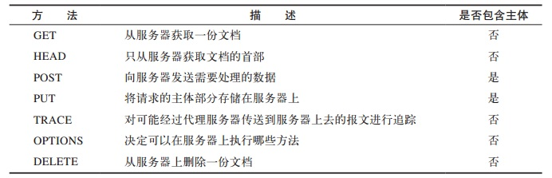
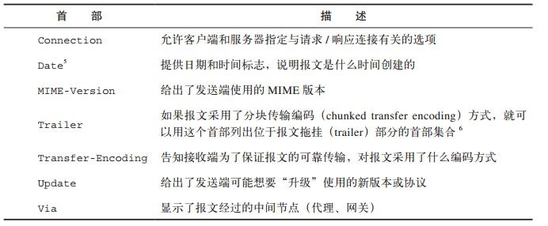
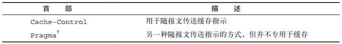
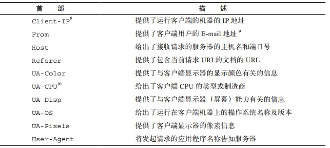
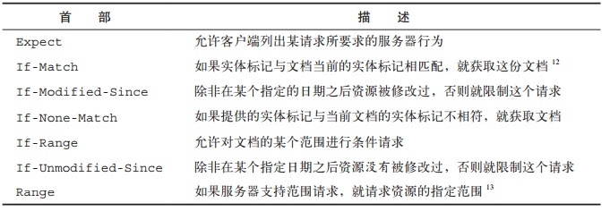
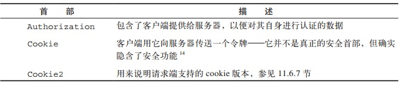
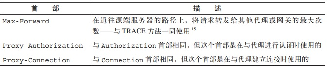
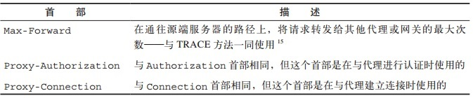

http 协议
===
**前言:讲解 HTTP 协议，理解 http 协议构成及常见使用方法**

---

# http 概述
## http 0.9
1991 年发布。
最早的 http 只能用来请求 html 页面，只有 get 方法，举例如下：

    //请求
    GET/index.html
    
    //响应
    <html>
        ...
    </html>    

## http 1.0
1996 年5月发布了新版本。
支持各种文档类型的发送。同时引入了`post、head`方法，丰富了浏览器和服务器的交互手段。
同时还增加了状态码，内容编码等设置。

    //请求
    GET / HTTP/1.0
    User-Agent: Mozilla/5.0 (Macintosh; Intel Mac OS X 10_10_5)
    Accept: */*
    
    //响应
    HTTP/1.0 200 OK 
    Content-Type: text/plain
    Content-Length: 137582
    Expires: Thu, 05 Dec 1997 16:00:00 GMT
    Last-Modified: Wed, 5 August 1996 15:55:28 GMT
    Server: Apache 0.84
    
    <html>
      <body>Hello World</body>
    </html>

缺点是发送完后连接及关闭，无法进行有效的长连接。于是浏览器中出现了非标准的
`connection`字段当`connection:kepp-alive`表示长连接。
## http 1.1
基于上面的原因，改版本映入了持久连接。默认为持久连接。
若要关闭，客户端只需在最后一个请求时加入`connection:close`即可
对于同一域名，大多数浏览器允许同时建立 6 个持久连接。
为了进一步增加效率，添加了管道机制，支持请求队列的收发，而不是单独的接收响应。
同时新增了`put、patch`等方法。但是有管道的处理，可能出现请求队列的堵塞。
多个持久连接也会导致资源的浪费。

## http/2
多工双向同时操作。


# http 报文详解
## http 的组成
http 是一个应用层的传输协议。规定了协议的通讯规则，和不同身份在协议中的处理方式。
这个就像暗号一样，暗号本身是一种会话约定等同于协议的约定。
而谁能发起暗号，就类似于协议中的会话角色。
所以在学习时除了理解协议本身的规则，还因该理解协议的会话角色及作用。
### 协议概述
http 协议是已发送请求模式运行的，及客户端发起一个 http 请求，服务端根据请求进行
响应。这样一次通讯称为一次会话。会话是建立在 tcp/ip 的基础上。相关的术语如下。

### 会话角色   
协议规定了通讯的方式，而会话角色是实现通讯的实体，常见的会话角色如下。

* **客户端**     
为发送请求建立连接的程序，比如我们在浏览器上输入的网址或在网页中填写的表单等都是连接请求。

* **用户代理**   
初始化请求的程序，例如我们使用的浏览器，脚本工具等都是可以发起用户请求的程序。

* **服务器**
用来处理用户请求的程序，包括源服务器和各种代理

* **源服务器**
存在请求的原始资源的服务器

* **代理**
代理是一个既可以充当客户端也可以当担服务器的角色，代理必须同时实现客户端和服务端的功能。
代理分为两种
    * 非透明代理
    需要修改请求或响应，以便为用户代理提供附加服务，提供注释服务，媒体类型转换，协议简化等功能。
    * 透明代理
    需要代理认证和代理识别，不能修改请求和响应

* **网关**
网关类似于请求资源的源服务器。

* **隧道**
隧道是一个中继通道，不属于 http 协议的参与者

* **缓存**
缓存中存放着可缓存的响应内容，为的是减少对将来同样请求的响应时间和网络带宽的消耗。
任何客户端和服务端都可能含有缓存，但缓存不能存在于充当隧道的服务器中。
缓存中存在的概念
    * 第一手
    表示响应是由源服务器返回并没有进过代理的延时表示第一手
    * 显示过期时间
    当请求的时间超过响应的显示过期时间时，不能够利用缓存去响应请求
    * 年龄
    响应发送后的持续时间
    * 保鲜时间
    一个响应产生到过期的时间
    * 保鲜
    响应年龄未超过保鲜时间称为保鲜
    * 陈旧
    响应年龄超过了保鲜时间
    * 语意透明
    缓存的使用不会对请求客户端和源服务器造成影响称为语义透明
    * 验证器
    用来验证缓存副本是否和源服务器中的资源相同，利用实体标签或最后修改时间进行判别。
    * 上游/下游
    表示消息流动的方向，所有消息都是从上游到下游
    * 内向/外向
    指消息的请求和响应路径，内向即移向服务器，外向即移向用户代理。
[理解 URL,URI,URN](http://www.ibm.com/developerworks/cn/xml/x-urlni.html)

从编程人员的角度，对于协议重在理解协议的传输方式，和加解包流程，而对于通讯相关的具体细节不是我们所考量的

# http 报文组成
http 的一个完整通讯由请求和响应组成,每个请求和响应包都可以理解为 HTTP 的一个报文，不管是
请求报文还是响应报文，都由**起始行**、**可选首部**、**可选的数据主体**三部分组成，每个部分的结尾依靠
CRLF 来进行结尾（表示 ASCII 码的 13 和 10）
```
   起始行（start-line） 
   *(message-header CRLF)
   CRLF
   [message-body]
```


下面分别介绍，请求报文和响应报文的格式区别。
## 请求报文
用来向服务器发送资源请求或控制命令，请求报文组成如下
```
    <方法><URL><版本>   --> 请求起始行
    <首部>             --> 可选首部
    <实体>             --> 可选实体
```
###　请求起始行
```
Request-Line = Method SP Request-URL SP HTTP-Verison CRLF 
//起始行的组成= 方法 + 空格 + 请求URL + 空格 + http版本 + 回车换行符
```
在调用`ajax`等 http 接口时，方法和url是我们关注的重点。   
### method
方法的作用在于告知服务器如何处理请求
常见的方法如下(来自 http 权威指南)

1. 当服务器可以理解但是，请求不被允许状态码为 405 （方法不被允许）
2. 当服务器不支持此方法时，返回  501 （表示方法不被允许）

２. url
```
Request-URI = "*" | absoluteURI | abs_path | authrotity 
//* 表示请求只针对服务器本身而非某个资源
//绝对 url 可能会被代理服务器转发
//绝对路径，客户端需要附加主机的根目录下可以工作
//当 url 为 URI 时，忽略请求头中的 Host 字段
//当为绝对路径时，请求头有首部的 Host 字段确定
//当请求 url 无效时，返回 400(坏请求)
//authrotity 只针对 connect 方法

```

３. 版本
一般为 http1.1


### 请求首部
详细首部如下:
```
   request-header = Accept 
                  | Accept-Charset
                  | Accept-Encoding
                  | Accept-Language
                  | Authorization
                  | Expect
                  | From
                  | Host
                  | if-Match
                  | if-Modified-Since
                  | if-None-Match
                  | if-Range
                  | if-Unmodified-Since
                  | Max-Forwards
                  | Proxy-Authorization
                  | Range
                  | Referer
                  | TE
                  | user-Agent
                  
                                                     
```     
首部可以理解为对报文和发送模式的控制指令，以键值对的方式表示，不论是接收还是发送报文，
HTTP 规定了以下几种类型的首部
* 通用首部<br>
  既可以出现在请求报文也可以出现在响应报文。

* 请求首部<br>
  提供跟请求有关的消息

* 响应首部<br>
  提供更多有关响应的消息

* 实体首部<br>
  描述实体的长度和内容，或者资源自身

* 扩展首部<br>
  规范中没有定义的新首部
由于这里讲解请求首部，

首部的名值对之间每个单独一行若出现较长的名值对，会在下一行前出现制表符，来说明这是
一项首部的键值

    Content-Type: image/gif ---> 实体首部描述内容
    Conrenr-Length: 8572    ---> 实体首部描述内容长度
    Server: Test Server     ---> 响应首部描述服务器信息
        Version 1.0         ---> 同属于上一行，在前面用 tab 缩进来表示

通用首部
* 信息性首部
    
* 通用缓存首部
    

请求首部
> 1. 请求信息首部
>
>    **服务器会利用其中的 UA 信息来决定推送的内容**例如判别用户是 PC 端访问还是移动端访问。
>
>    

> 2. Accept 首部
>
>   客户端告知服务器自己的需要的规则
>
>   

> 3. 条件请求头首部
>
>   客户端告知服务器自己的需要的规则
>
>   

> 2. Accept 首部
>
>   客户端告知服务器自己的需要的规则
>
>   

> 2. Accept 首部
>
>   客户端告知服务器自己的需要的规则
>
>   


### 请求实体
在 HTTP0.9 的早期协议中，请求报文只有方法和 URL ，响应报文只包含实体，这从某种程度上说明，
请求报文实际上并不一定要有实体信息，所以这里对常见的请求方法中，包含请求内容的方式做一个概述，
注意**请求报文向服务端发送数据时，数据包不一定出现在实体中，也可以在请求首部或起始行中包含
需要发送的内容**


# 请求报文

## 响应报文
用来响应客户端的数据请求，响应报文组成如下
```
    <版本><状态><原因短语>   --> 组成起始行
    <首部>             --> 组成首部
    <实体>             --> 组成实体，对于请求报文不一定包含实体
```
### 版本
### 状态码
三位数字用来描述，请求的结果

###　原因短语
用来描述数字状态码所表达的含义


<span style="border:1px red solid;">请求头</span>


## 响应
服务器向依据客户端的请求响应的内容
```
   response = Status-Line 
              *((general-header)
               | response-header
               | entity-header CRLF)
               CRLF
               [message-body]
    
```
### 响应起始行
```
   Status-Line = HTTP-Version SP Status-Code SP Reason-Phrase CRLF 
   //响应起始行 = http 版本 + 空格  + 状态码 + 空格 + 结果说明 + 回车换行
```
响应起始行比较重要的内容包括，状态码
#### 状态码讲解
```
   -1XX: 报告的        -请求被接收到，继续处理
   -2XX: 成功         -被成功接收(received)，理解(understand)，接受(accepted) 的动作
   -3XX: 重发         -为了完成请求必须采取进一步动作
   -4XX: 客户端出错    -请求包括语法错误或不能被满足
   -5XX: 服务器出错    -服务器不能满足有效的请求   
   
   状态码说明：
    Status-Code    =
       "100"  ; Section 10.1.1: 继续
     | "101"  ; Section 10.1.2: 转换协议
     | "200"  ; Section 10.2.1: 请求成功
     | "201"  ; Section 10.2.2: 已创建
     | "202"  ; Section 10.2.3: 已接受
     | "203"  ; Section 10.2.4: 非权威信息
     | "204"  ; Section 10.2.5: 无内容
     | "205"  ; Section 10.2.6: 重置内容 
     | "206"  ; Section 10.2.7: 部分内容
     | "300"  ; Section 10.3.1: 多个选择
     | "301"  ; Section 10.3.2: 永久移动
     | "302"  ; Section 10.3.3: Found
     | "303"  ; Section 10.3.4: See Other
     | "304"  ; Section 10.3.5: Not Modified
     | "305"  ; Section 10.3.6: Use Proxy
     | "307"  ; Section 10.3.8: Temporary Redirect
     | "400"  ; Section 10.4.1: Bad Request
     | "401"  ; Section 10.4.2: Unauthorized
     | "402"  ; Section 10.4.3: Payment Required
     | "403"  ; Section 10.4.4: Forbidden
     | "404"  ; Section 10.4.5: Not Found
     | "405"  ; Section 10.4.6: Method Not Allowed
     | "406"  ; Section 10.4.7: Not Acceptable
     | "407"  ; Section 10.4.8: Proxy Authentication Required
     | "408"  ; Section 10.4.9: Request Time-out
     | "409"  ; Section 10.4.10: Conflict
     | "410"  ; Section 10.4.11: Gone
     | "411"  ; Section 10.4.12: Length Required
     | "412"  ; Section 10.4.13: Precondition Failed
     | "413"  ; Section 10.4.14: Request Entity Too Large
     | "414"  ; Section 10.4.15: Request-URI Too Large
     | "415"  ; Section 10.4.16: Unsupported Media Type
     | "416"  ; Section 10.4.17: Requested range not satisfiable
     | "417"  ; Section 10.4.18: Expectation Failed
     | "500"  ; Section 10.5.1: Internal Server Error
     | "501"  ; Section 10.5.2: Not Implemented
     | "502"  ; Section 10.5.3: Bad Gateway
     | "503"  ; Section 10.5.4: Service Unavailable
     | "504"  ; Section 10.5.5: Gateway Time-out
     | "505"  ; Section 10.5.6: HTTP Version not supported
     | extension-code
   
```
注意状态码是可扩展的，未被识别的状态码回归类到`x00` 的类别中，比如 431 不存在。
客户端会当做 400 来处理。


### 响应头域
Content-Type 标注实体内容
Content-length 标注实体长度
实体内容

详细首部如下:
```
   request-header = Accept-Ranges
                  | Age
                  | Etag
                  | Location
                  | Proxy-Authenticate
                  | Retry-After
                  | Server
                  | Vary
                  | WWW-Authenticate     
                                                     
```  

### 响应实体 
响应实体由实体头域和实体组成
#### 实体头域 (Entity Header Fields)
```
    entity-header  = Allow                    ; Section 14.7
                     | Content-Encoding         ; Section 14.11
                     | Content-Language         ; Section 14.12
                     | Content-Length           ; Section 14.13
                     | Content-Location         ; Section 14.14
                     | Content-MD5              ; Section 14.15
                     | Content-Range            ; Section 14.16
                     | Content-Type             ; Section 14.17
                     | Expires                  ; Section 14.21
                     | Last-Modified            ; Section 14.29
                     | extension-header 
```
实体头域也可以扩展

#### 实体
```
   Entity-body = *OCTET 
```
实体只有当消息主题存在时才存在，实体主体依据 `Transfer-Encoding` 进行解码

但消息包含实体主题时，主体数据的类型有实体头域`Content-Type`和`Content-Encoding`头域共同确定。
在不包含`Content-Type`的情况下，客户端会将其作为`application/octec-stream`解码。
实体的主体长度是指消息主题在被应用于传输编码`transfer-coding`之前的长度。


## 媒体类型
#### [form content type](https://www.w3.org/TR/html401/interact/forms.html#h-17.13.4)
理解媒体类型 

## 连接的判断


## 编程理解
http 本身只是一个协议，建立在 TCP/IP 的连接基础上，连接后即可进行通讯，利用
socket 可以完全仿真 http 协议的过程。只要理解协议的发送规则即可。
协议的本身建立在传输层之上。实际上在linux上直接使用 telnet就可以实现
类似 socket 编程一样的效果。


# 参考资源
[http 协议讲解](http://www.admin10000.com/document/9288.html)

[node 使用 fiddler](https://weblogs.asp.net/dixin/use-fiddler-with-node-js)

[http 状态码](https://github.com/prettymuchbryce/node-http-status)

[mdn http 详细状态码](https://developer.mozilla.org/zh-CN/docs/Web/HTTP/Status)

[rfc 2616](https://www.ietf.org/rfc/rfc2616.txt)

